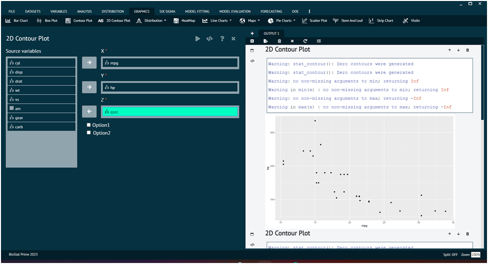

# AB 2D Contour Plot

For representing any dataset in terms of AB 2D Contour Plot.

Steps
: __Load the dataset that needs to be visualized -> Go to Graphics -> AB 2D Contour Plot -> Put in the values for variables -> Execute the dialog.__

The output of the 2D Contour Plot of a sample dataset can be seen in the picture below.

{ width="700" }{ border-effect="rounded" }
