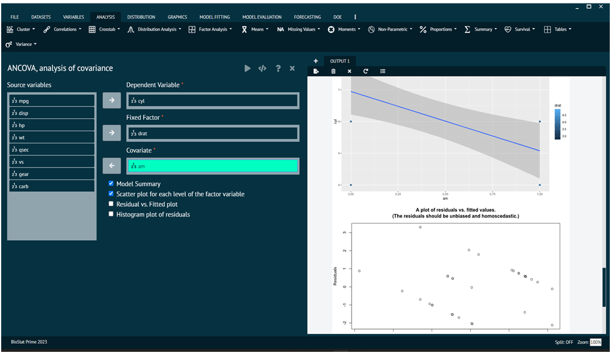

# ANCOVA

### ANCOVA

ANCOVA stands for Analysis of Covariance. It is a statistical technique that combines the principles of analysis of variance (ANOVA) with regression. ANCOVA is used to compare group means while statistically controlling for the effects of other continuous variables that are not of primary interest, referred to as covariates. The main idea behind ANCOVA is to remove the variance associated with the covariates from the dependent variable, allowing for a more accurate assessment of the group differences in the variable of interest. This is particularly useful when there is reason to believe that the covariates are related to the dependent variable, and you want to account for this relationship in the analysis.

To analyse it in BioStat Prime user must follow the steps as given.

__Load the dataset -> Click on the analysis tab in main menu -> Select means -> The means tab leads to the ANCOVA analysis technique in the dialog -> In the dialog select the variable and options according to the requirement -> Execute the dialog.__

{ width="700" }{ border-effect="rounded" }

The output of the analysis is shown in the output window. The user can also opt for Model Summary, Scatter plot for each level of the factor variable, Residual vs. Fitted plot, Histogram plot of residuals visualise the output as a plot.
