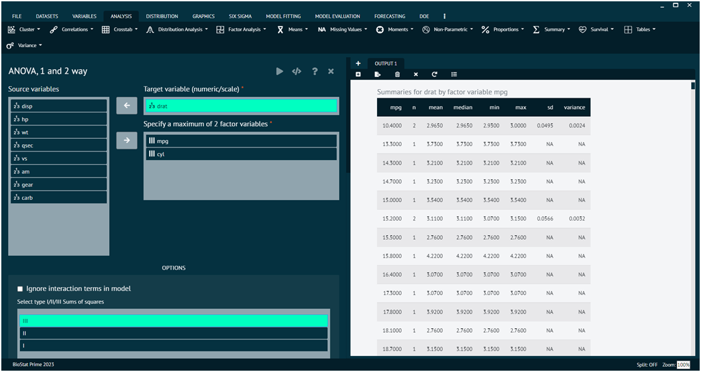

# ANOVA, 1 and 2 way

ANOVA, or Analysis of Variance, is a statistical method used to analyze the differences among group means in a sample. 

There are two main types of ANOVA: __one-way ANOVA__ and __two-way ANOVA__. 

One-Way ANOVA is used when there is one independent variable (factor) with more than two levels (groups).

Two-Way ANOVA is an extension of One-Way ANOVA and is used when there are two independent variables (factors).

>The aov function in R is commonly used for performing ANOVA.
>
{style="note"}

To analyse it in BioStat Prime user must follow the steps as given.

{type="full"}
Steps
:
__Load the dataset -> Click on the analysis tab in main menu -> Select means -> The means tab leads to the ANOVA,1 and 2 way analysis technique in the dialog -> In the dialog select the variable and options according to the requirement -> Execute the dialog.__

{ width="700" }{ border-effect="rounded" }

This function fits an analysis of variance model along with data summaries, displays type I,II,III sum of squares, displays marginal means and contrasts (using marginal means). Model is built with and without interaction effects. 

>Optionally performs Levene's test for homogeneity of variance across groups and plots graphs.
>
{style="note"}