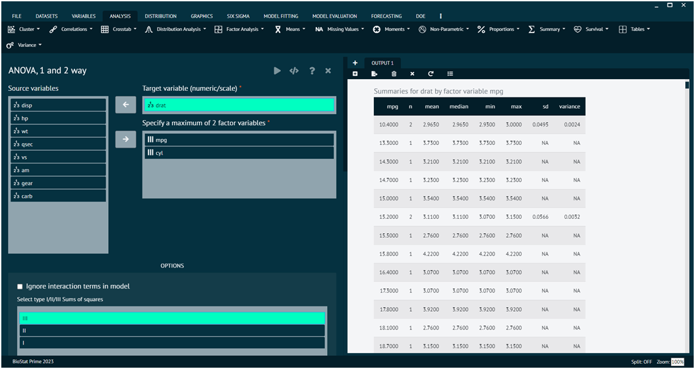

# ANOVA, 1 and 2 way

ANOVA, or Analysis of Variance, is a statistical method used to analyze the differences among group means in a sample. There are two main types of ANOVA: one-way ANOVA and two-way ANOVA. One-Way ANOVA is used when there is one independent variable (factor) with more than two levels (groups).Two-Way ANOVA is an extension of One-Way ANOVA and is used when there are two independent variables (factors).The aov function in R is commonly used for performing ANOVA.

To analyse it in BioStat Prime user must follow the steps as given.

__Load the dataset -> Click on the analysis tab in main menu -> Select means -> The means tab leads to the ANOVA,1 and 2 way analysis technique in the dialog -> In the dialog select the variable and options according to the requirement -> Execute the dialog.__

{ width="700" }{ border-effect="rounded" }

Given below are other tests that can be performed by the user on BioStat Prime.
