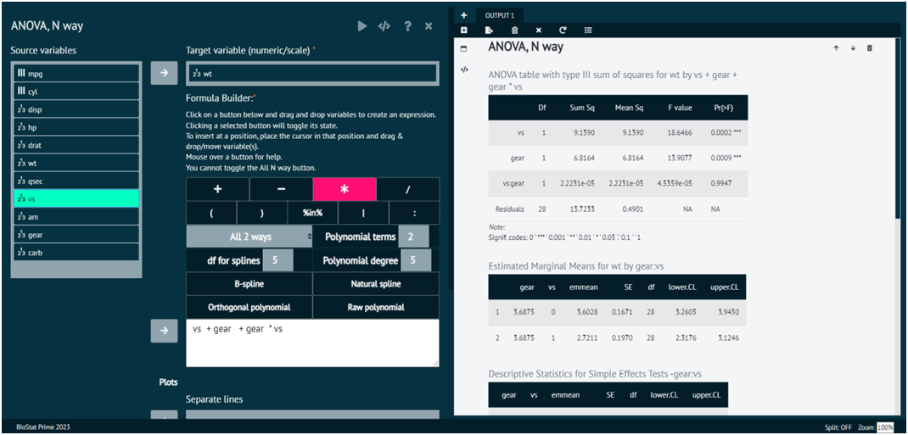

# ANOVA, N way

In statistics, an N-way ANOVA (Analysis of Variance) with blocks refers to a statistical analysis that involves multiple independent variables or factors (more than two). The term "blocks" in this context refers to a way of handling potential sources of variability that are not the primary focus of the study but need to be accounted for to improve the precision of the analysis. N-way ANOVA indicates that there are multiple independent variables (factors). For example, in a 2-way ANOVA, there are two independent variables, and in an N-way ANOVA, there are more than two. Each independent variable can have multiple levels or categories. N-way ANOVA with blocks involves analyzing the effects of multiple independent variables on a dependent variable while taking into account the potential impact of blocking variables.

To analyse it in BioStat Prime user must follow the steps as given.

__Load the dataset -> Click on the analysis tab in main menu -> Select means The means tab leads to the ANOVA, N way analysis technique in the dialog -> In the dialog select the target variable and create a formula according to the requirement -> Execute the dialog.__

The user can build a formula in the formula builder by following the steps given below.

1.	Click on a button in formula builder and drag and drop variables to create an expression.
2.	Clicking a selected button will toggle its state.
3.	To insert at a position, place the cursor in that position and drag & drop/move variable(s).
4.	Mouse over a button for help.
5.	User cannot toggle the All N way button.

{ width="700" }{ border-effect="rounded" }
