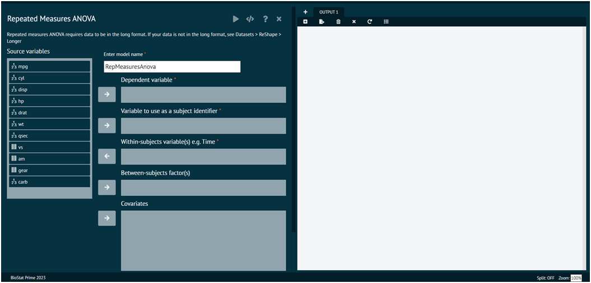

# ANOVA Repeated Measures, Long

With repeated measures ANOVA F statistics are computed for each within subjects factor, between subject factor and the interaction term for mixed ANOVA

>BioStat Prime currently support a single within subject and between subject factor, the between subject factor is optional.
>
{style="note"}

{ width="700" }{ border-effect="rounded" }

>Arguments

data
: A data.frame containing the data. Mandatory

dv
: character vector (of length 1) indicating the column containing the dependent variable in data.

between
: character vector indicating the between-subject(s) factor(s)/column(s) in data. Default is NULL indicating no between-subjects factors.

within
: character vector indicating the within-subject(s)(or repeated-measures) factor(s)/column(s) in data. Default is NULL indicating no within-subjects factors.

covariate
: character vector indicating the between-subject(s) covariate(s) (i.e., column(s)) in data. Default is NULL indicating no covariates. 

>Please note that factorize needs to be set to FALSE in case the covariate is numeric and should be treated as such.
>
{style="note"}

anovatable
: list of further arguments passed to function producing the ANOVA table.