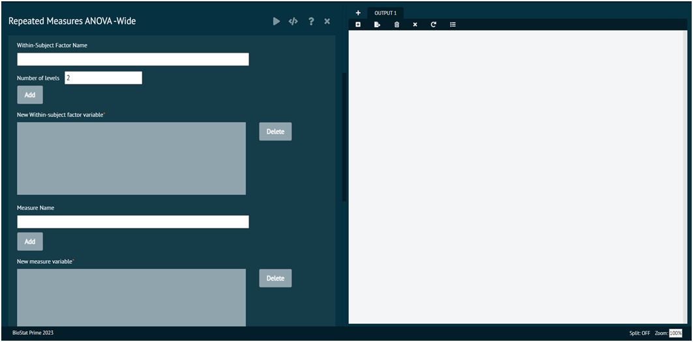

# ANOVA Repeated Measures, Wide

With repeated measures ANOVA F statistics are computed for each within subjects factor, between subject factor and the interaction term for mixed ANOVA

>BioStat Prime currently support a single within subject and between subject factor, the between subject factor is optional.
>
{style="note"}

{ width="700" }{ border-effect="rounded" }

>NOTE:
>1. BioStat Prime needs to reshape the data when running a repeated measures ANOVA on a wide dataset
>2. BioStat Prime supports multiple repeated measures for a single variable e.g. Blood Sugar measured at pretest, posttest and at a followup visit
>3. User needs to specify a repeated factor name e.g. Blood Sugar and the number of levels. BioStat Prime will create a factor variable e.g. named Blood Sugar with levels created from the names of the variables containing the repeated measures e.g. the levels of the factor will be pretest, posttest and followup
>4. User needs to specify a measure name e.g. Value. BioStat Prime will create a variable e.g. Value with all the Blood Sugar values corresponding to the pretest, posttest and followup for each subject.
>5. BioStat Prime supports a single between-subject and within-subject factor variable.
>6. Future versions will support multiple measures as well as multiple between subject and within subject factor variables.
>7. By default each row of the dataset corresponds to a unique subject, user can also specify a variable for the subject ID.
