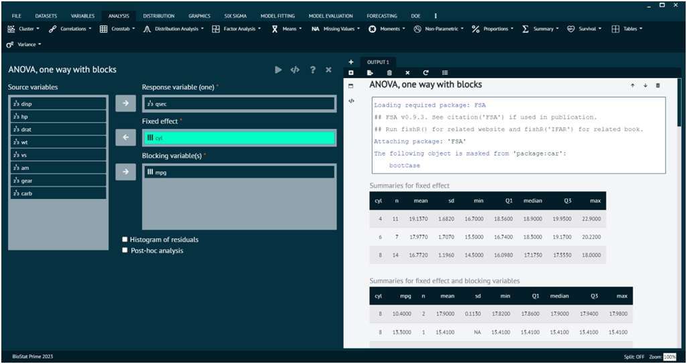

# ANOVA, one way with blocks

The "one-way" ANOVA refers to a scenario where there is one independent variable (factor) that categorizes the data into different groups, and you are interested in comparing the means of these groups to determine if there are any statistically significant differences. The term "with blocks" in ANOVA typically refers to a design that includes the concept of blocking. Blocking is used when there are known sources of variability that are not of primary interest but should be taken into account to increase the precision of the experiment. Blocks are used to create more homogeneous groups within which the experimental units are similar.

In the context of a one-way ANOVA with blocks, you would have one main factor (e.g., a treatment or condition), and the blocks would be another variable that is not the primary focus of your study but is thought to contribute to variability. The idea is to account for the variability due to the blocks so that you can better detect differences related to the main factor.

To analyse it in BioStat Prime user must follow the steps as given.

__Load the dataset -> Click on the analysis tab in main menu -> Select means -> The means tab leads to the ANOVA, one way with blocks analysis technique in the dialog -> In the dialog select the variable and options according to the requirement -> Execute the dialog.__

{ width="700" }{ border-effect="rounded" }
