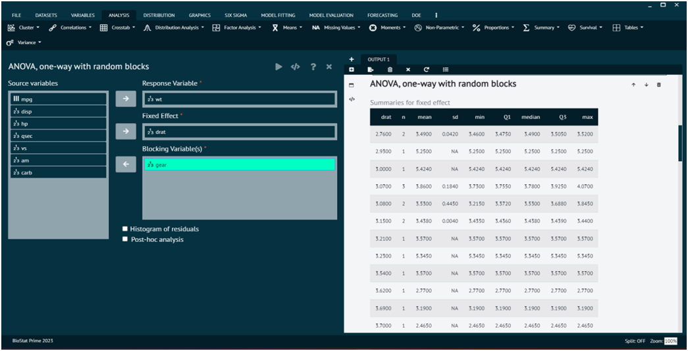
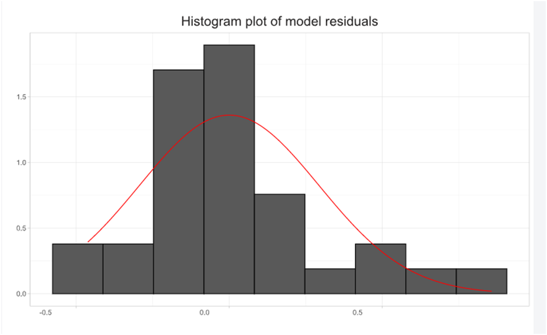
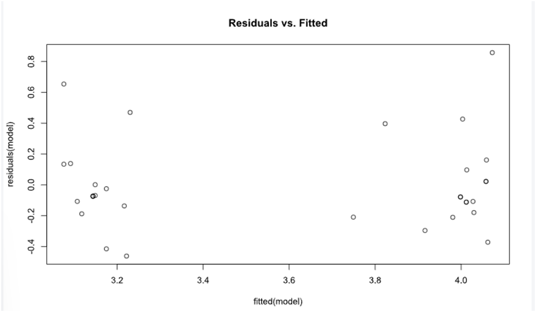

# ANOVA, one-way with random blocks

In analysis of variance (ANOVA), the one-way ANOVA with random blocks is a variation of the traditional one-way ANOVA that incorporates the concept of random blocks. This design is often used when there is a potential source of variability in the experiment that is not of primary interest but needs to be controlled for. In the context of ANOVA, blocks refer to groups or conditions that are not of primary interest but introduce variability. These blocks are considered random because their levels are randomly selected from a larger population. The inclusion of random blocks helps to control for the potential impact of these extraneous factors.

To analyse it in BioStat Prime user must follow the steps as given.

__Load the dataset -> Click on the analysis tab in main menu -> Select means -> The means tab leads to the ANOVA, one-way with random blocks analysis technique in the dialog -> In the dialog select the variable and options according to the requirement -> Execute the dialog.__

{ width="700" }{ border-effect="rounded" }

The output of the analysis is shown in the output window. The user can also opt for Histogram of residuals, Post-hoc analysis.

{ width="700" }{ border-effect="rounded" }

{ width="700" }{ border-effect="rounded" }
