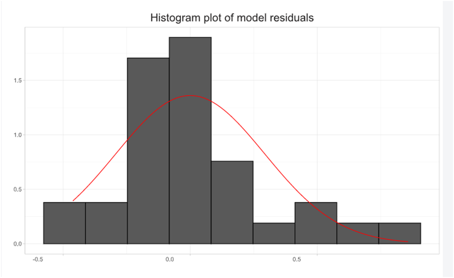
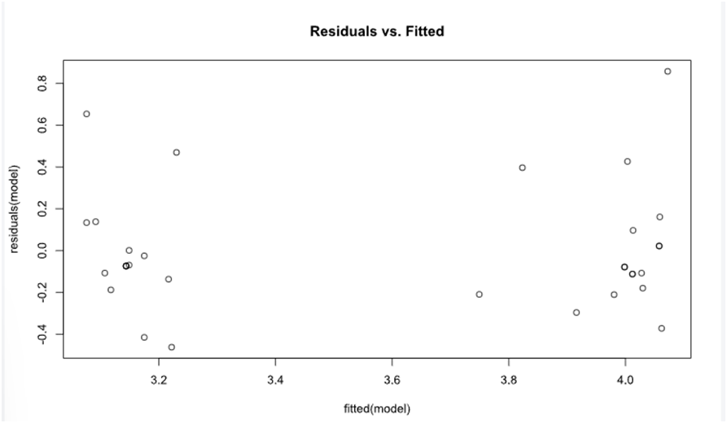

# ANOVA, one-way with random blocks

In analysis of variance (ANOVA), the one-way ANOVA with random blocks is a variation of the traditional one-way ANOVA that incorporates the concept of random blocks. This design is often used when there is a potential source of variability in the experiment that is not of primary interest but needs to be controlled for. 

>In the context of ANOVA, blocks refer to groups or conditions that are not of primary interest but introduce variability. These blocks are considered random because their levels are randomly selected from a larger population. 
>The inclusion of random blocks helps to control for the potential impact of these extraneous factors.

Fits a linear mixed-effects model (LMM) to data, via REML or maximum likelihood

To analyse it in BioStat Prime user must follow the steps as given.

Steps
: __Load the dataset -> Click on the analysis tab in main menu -> Select means -> The means tab leads to the ANOVA, one-way with random blocks analysis technique in the dialog -> In the dialog select the variable and options according to the requirement -> Execute the dialog.__

{ width="700" }{ border-effect="rounded" }

The output of the analysis is shown in the output window. The user can also opt for Histogram of residuals, Post-hoc analysis.

{ width="700" }{ border-effect="rounded" }

{ width="700" }{ border-effect="rounded" }

Arguments

formula
: a two-sided linear formula object describing both the fixed-effects and random-effects part of the model, with the response on the left of a ~ operator and the terms, separated by +operators, on the right. Random-effects terms are distinguished by vertical bars (|) separating expressions for design matrices from grouping factors. Two vertical bars (||) can be used to specify multiple uncorrelated random effects for the same grouping variable. (Because of the way it is implemented, the ||-syntax works only for design matrices containing numeric (continuous) predictors; to fit models with independent categorical effects, see dummy or the lmer_alt function from the afex package.)

data
: an optional data frame containing the variables named in formula. By default the variables are taken from the environment from which lmer is called. While data is optional, the package authors strongly recommend its use, especially when later applying methods such as update and drop1 to the fitted model (such methods are not guaranteed to work properly if data is omitted). If data is omitted, variables will be taken from the environment of formula (if specified as a formula) or from the parent frame (if specified as a character vector).

REML
: logical scalar - Should the estimates be chosen to optimize the REML criterion (as opposed to the log-likelihood)? na.action: a function that indicates what should happen when the data contain NAs. The default action (na.omit, inherited from the 'factory fresh' value of getOption("na.action")) strips any observations with any missing values in any variables.