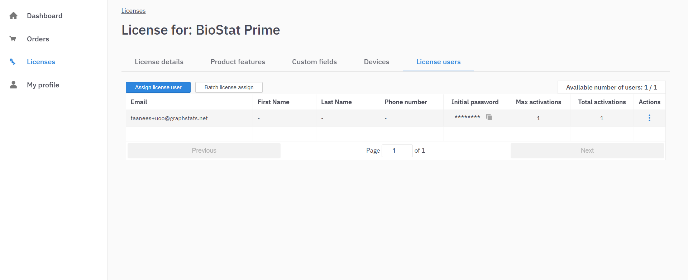

# License Activation Guide

To access the full features of BioStat Prime, User needs to activate your license. Follow the steps below to complete the activation process.

## Prerequisites

1. A stable and active internet connection.
2. A successfully completed payment for the purchased license.
3. Ensure that the email address used for payment is selected carefully, as it will be used for activation and serve as the primary point of communication.

## Activation via Account Login

1. After completing the payment successfully, the user will receive an email containing credentials to log in to the user portal. This portal provides access to the software installer link and license activation credentials.

{ width="700" }{ border-effect="rounded" }

2. Upon receiving the email, the user should log in to the portal using the provided credentials to access their account.

{ width="700" }{ border-effect="rounded" }

3. Once logged in, the user will find the license issued to the email address used during payment.

{ width="700" }{ border-effect="rounded" }

4. Selecting the issued license redirects the user to a detailed page that includes license information and a link to download the software installer.

{ width="700" }{ border-effect="rounded" }

{ width="700" }{ border-effect="rounded" }

5. After downloading the software, the user can proceed with the activation process.

6. Within the portal, the user can navigate to the "Users" tab. Clicking this tab opens a section containing the license activation credentials.

{ width="700" }{ border-effect="rounded" }

7. The user must copy the provided credentials and use them to activate the license successfully.
8. The user must change the temporary password for dashboard as well as for the license as soon as possible

{ width="700" }{ border-effect="rounded" }

## Activating Trial License