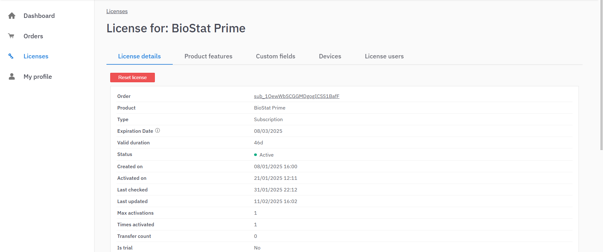

# License Activation Guide

To unlock the full functionality of BioStat Prime, user must activate the license. Follow the steps below to complete the activation process.

>__Prerequisites__
> 
>Before proceeding with the activation of BioStat Prime, ensure the following requirements are met:
>
>1. Stable Internet Connection – A reliable and active internet connection is required for license activation.
>2. Valid License Purchase – The license must be successfully purchased and processed.
>3. Registered Email Address – Ensure that the email address used for payment is correctly selected and retained, as it will be required for activation and it serves as the primary point of communication for license-related matters.
>4. Administrator Privileges – Ensure you have the necessary permissions to install and activate software on your device.
>
{style="note"}

## Activation via Account Login

1. After completing the payment successfully, the user will receive an email containing credentials to log in to the user portal. This portal provides access to the software installer link and license activation credentials.

{ width="700" }{ border-effect="rounded" }

2. Upon receiving the email, the user should log in to the LicenseSpring Dashboard using the provided credentials to manage their license and access account details.

{ width="700" }{ border-effect="rounded" }

3. Once logged into the LicenseSpring Dashboard, the user can access the details of the license issued to their registered email ID.

{ width="700" }{ border-effect="rounded" }

4. Selecting the issued license redirects the user to a detailed page that includes license information and a link to download the software installer.

{ width="700" }{ border-effect="rounded" }

{ width="700" }{ border-effect="rounded" }

>The installation steps, including the process of downloading and installing the software, are provided in the [next section](INSTALLATION.md).
>
{style="note"}

5. Once the software is downloaded and installed, the user can proceed with the activation process. The activation steps outlined below should be followed to activate the license when the software the first time it is run.

6. Within the portal, the user can navigate to the "License Users" tab. Clicking this tab opens a section containing the license activation credentials.

{ width="700" }{ border-effect="rounded" }

7. The user should copy the provided credentials and use them to complete the license activation process.

8. Additionally, it is strongly recommended to update the temporary password for both the Dashboard and the license at the earliest opportunity to ensure security.
{ width="700" }{ border-effect="rounded" }

## Activating Trial License