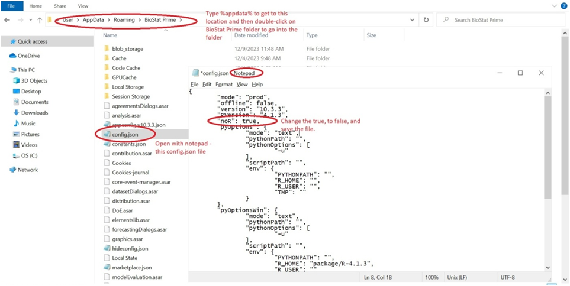
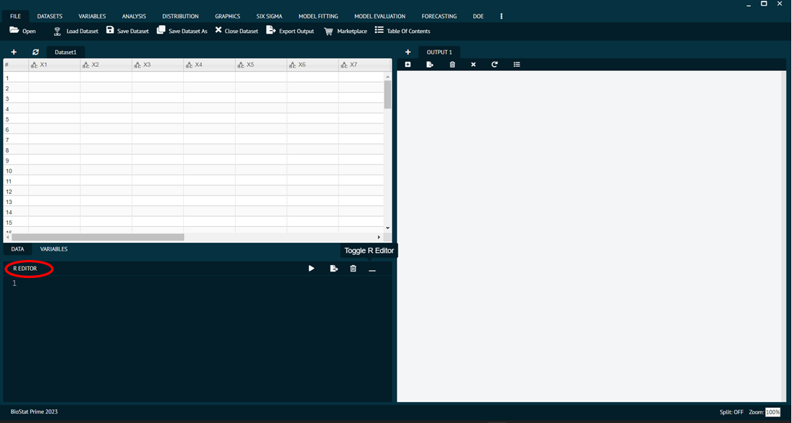
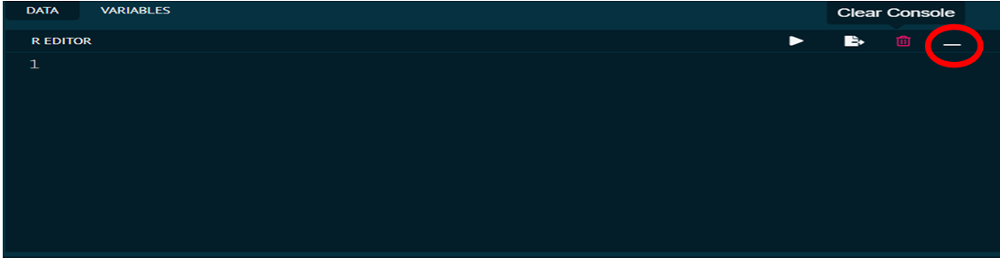
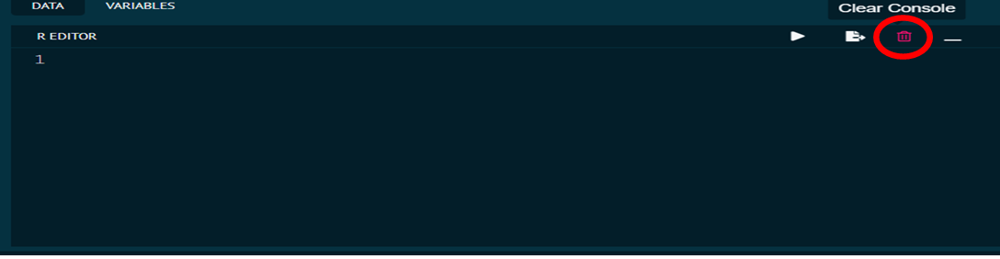
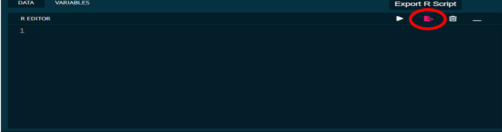
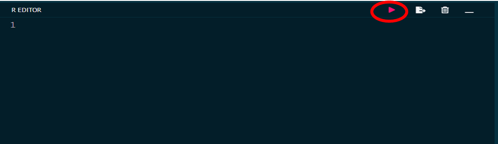

# Advanced Functionalities

In order to extend the functionalities of BioStat Prime, user can go a step further by enabling R console inside the software whenever needed. The R console provides user an opportunity for users, who knows the R programming language, to write, edit and execute the R code in console.

## How to Enable/ Disable R console

__Go to BioStat Prime folder in your directory -> Open config.json file(or config file of json type) with notepad -> Change the value true to false as shown in the picture below.__

{ width="700" }{ border-effect="rounded" }

Exit the BioStat Prime app if it is running before making the change to the configuration flag. Once user saves the configuration __->__ restart the app __->__ see the R Editor panel.
Do the same steps to reverse the configuration to hide the R Editor.

{ width="700" }{ border-effect="rounded" }

The options at top right corner of the R console are (from right to left).

__Toggle R Editor:__ Used to minimize or maximize the R console.

{ width="700" }{ border-effect="rounded" }

__Clear Console:__ Clears the entire code in R console.

{ width="700" }{ border-effect="rounded" }

__Export R Script:__ Used to save R script exporting it to the PC/Laptop.

{ width="700" }{ border-effect="rounded" }

__Execute Button:__ Executes the R script.

{ width="700" }{ border-effect="rounded" }