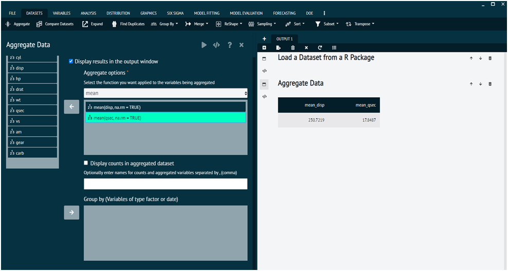

# Aggregate

Aggregates one or more numeric (scale) variables by one or more factor variables and creates a new aggregated dataset.

For numeric variables user can calculate the following: `mean`, `median`, `sum`, `std deviation`, `n_distinct`, `max`, `min` and `var`. It also computes the counts in the aggregated dataset.

{ width="700" }{ border-effect="rounded" }

To aggregate variables user needs to follow the steps given bellow.

{type="full"}
Steps
:
__Load the dataset -> click on the DATASET tab in main menu -> select AGGREGATE -> Once, the dialog appears select the functions to be applied to the variables being executed -> Execute the dialog.__

Output of aggregate is given as.

{ width="700" }{ border-effect="rounded" }

The arguments used is executing the dialog are given as follows.

>Arguments
> 1. var1: factor to group by
> 2. var2, var3: variable to aggregate
> 3. newvarmean: mean of var2 grouped by var1 in the aggregated dataset
> 4. ​newvarmedian: median of var3 grouped by var1 in the aggregated dataset