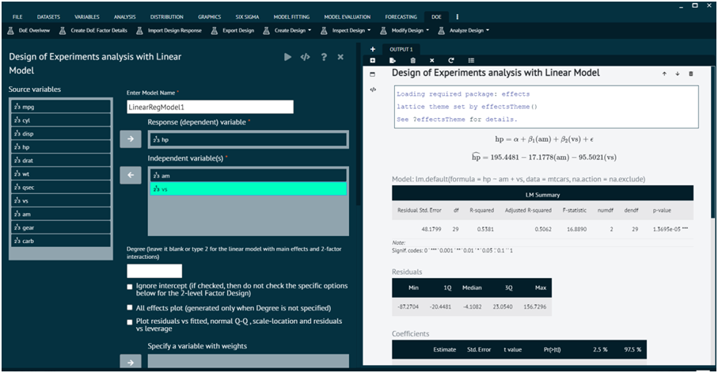
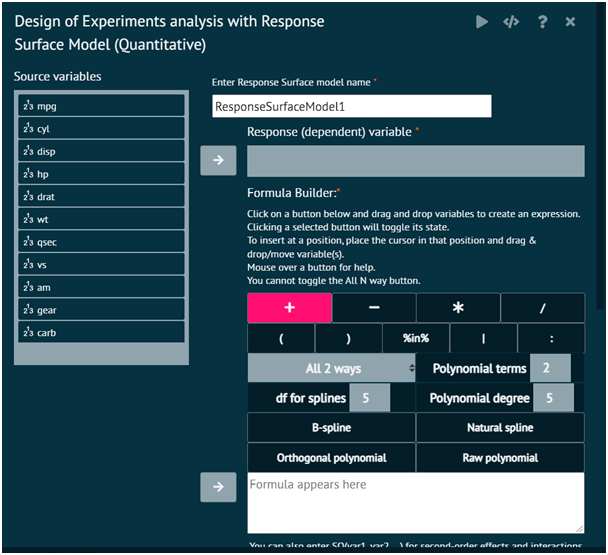
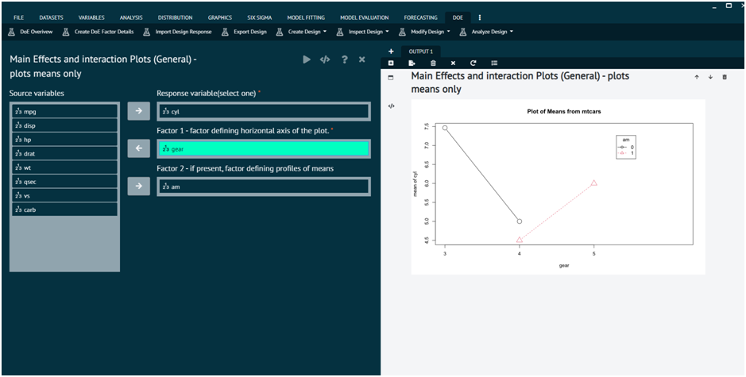
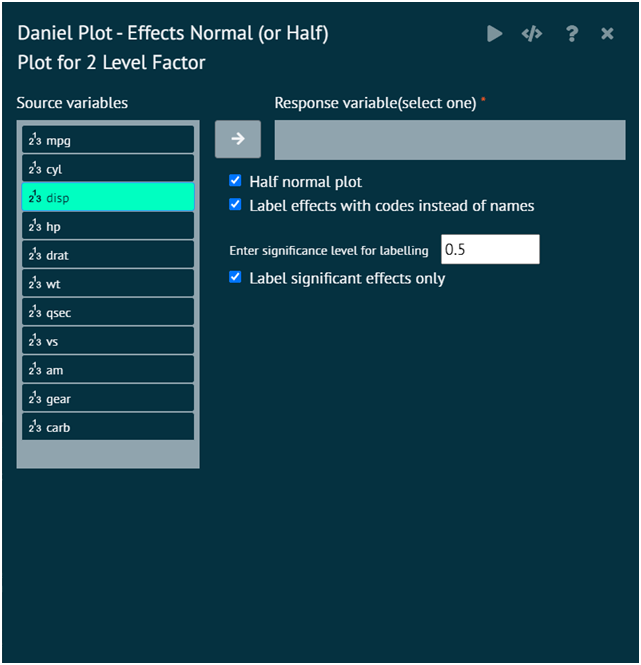
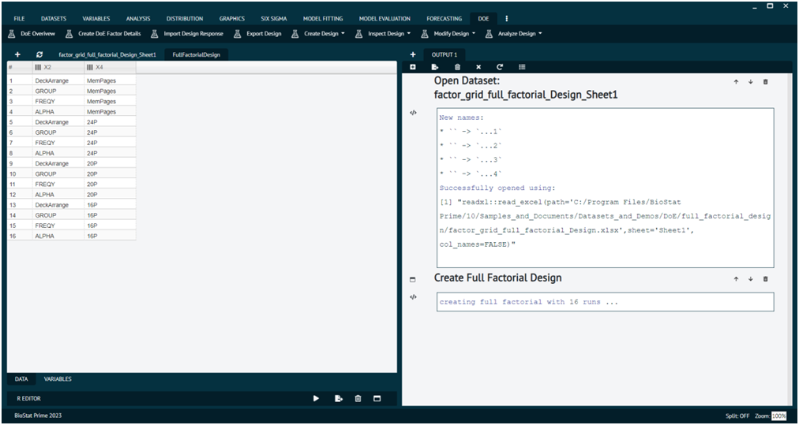
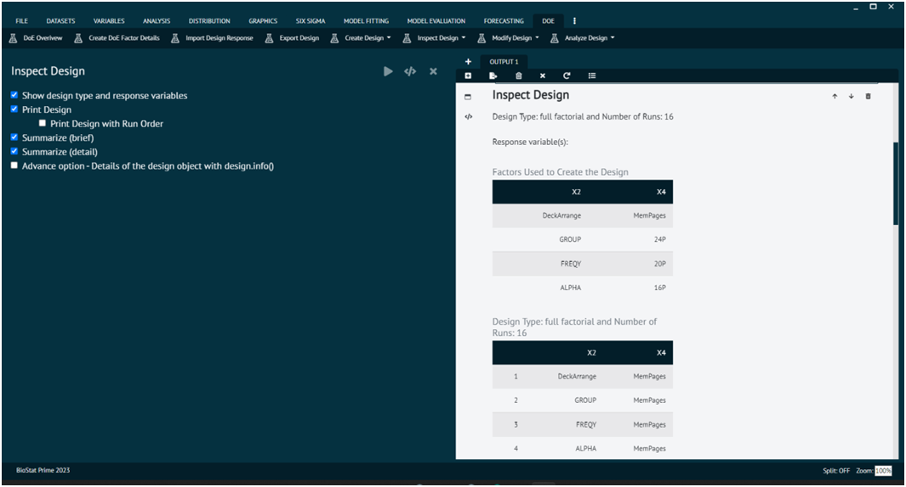
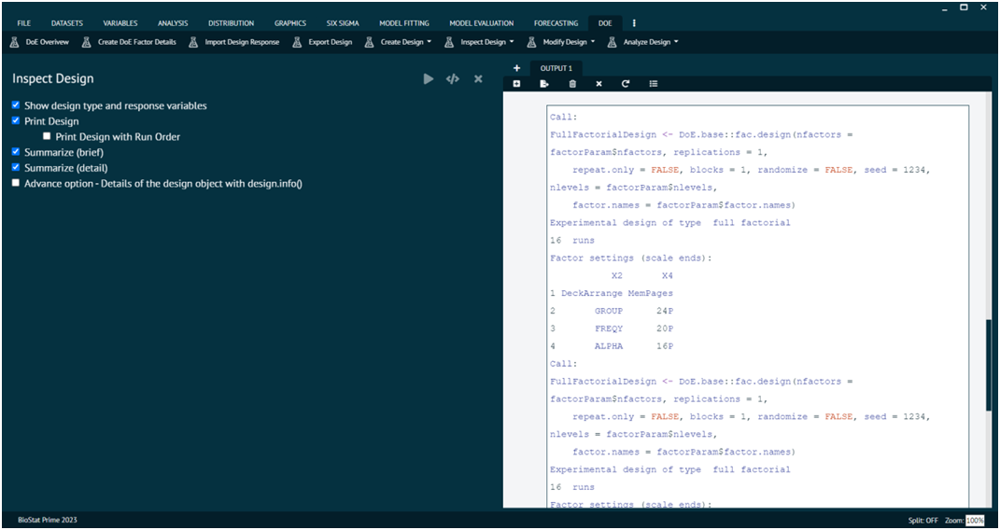

# Analyse Design

### Design Analysis-Linear Model

{ width="700" }{ border-effect="rounded" }

### Design Analysis-Response Surface Model

{ width="700" }{ border-effect="rounded" }

### Main Effect And Interaction Plots (General)

{ width="700" }{ border-effect="rounded" }

### Half Normal Plot For 2 levels

{ width="700" }{ border-effect="rounded" }

### Full Factor Analysis (in detail)

Full factorial analysis is a statistical method used in experimental design to study the effects of multiple factors on a response variable. It involves examining all possible combinations of factor levels in a systematic way. Two factors, each with two levels (A and B), a full factorial design would involve testing all combinations (AA, AB, BA, BB).
In experimentation, factorial experiments are highly prevalent. Most experiments are conducted using only two-level components, especially in industrial settings. It is crucial to have software that non-statisticians may use safely since subject-matter experts frequently design and carry out industrial experiments on their own without the assistance of a statistical specialist. Simultaneously, statisticians are frequently engaged in more significant experimental initiatives. A statistician greatly values assistance from robust software.

BioStat Prime aids this Statistical analysis technique by merging the powers of R language in this statistical method. The design of experiment section provides an extensive help to perform Full Factorial Analysis. BioStat Prime also provides some sample datasets to explore the functioning.

To analyse it in BioStat user must follow the steps as given.

__Load the dataset (as specified above in DoE section) -> Click on the DoE tab in main menu -> Select Create Design -> Choose Create Full Factorial Design -> This leads to analysis techniques in the dialog -> In the dialog window select the options according to the requirements -> Execute.__

The output will be represented in output window.The output window shows the message that Full Factorial Design has been created.

{ width="700" }{ border-effect="rounded" }

The user can now inspect the design as  shown below.

{ width="700" }{ border-effect="rounded" }

{ width="700" }{ border-effect="rounded" }
