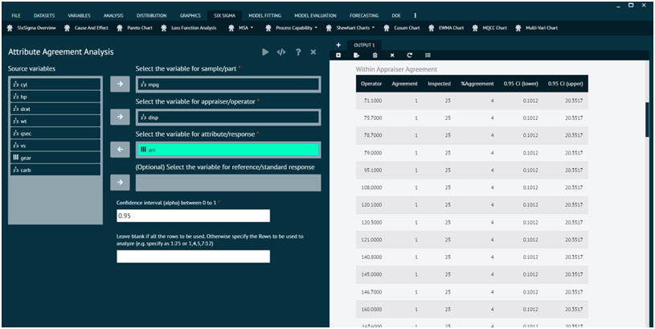
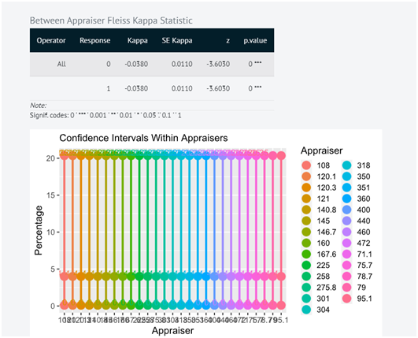

# Attribute Agreement Analysis

Attribute Agreement Analysis is a specific method within Measurement System Analysis (MSA) that focuses on assessing the agreement or reliability of categorical or attribute data among different appraisers. 

This analysis is particularly useful when the measurement system involves subjective judgments or classifications, such as visual inspections, quality ratings, or pass/fail decisions. 

The primary objective of Attribute Agreement Analysis is to quantify the level of agreement or disagreement between different individuals or appraisers when making judgments about the same set of items. This helps identify sources of variability in the measurement process that may be attributed to the appraisers rather than the actual characteristics of the items being assessed.

To analyse in Attribute Agreement Analysis BioStat user must follow the steps given below.

Steps
: __Load the dataset -> Click on the Six Sigma tab in main menu -> Select MSA -> Choose Attribute Agreement Analysis -> This leads to analysis techniques in the dialog -> Selected the various options in the dialog according to the requirement -> Execute and visualise the output in output window.__

{ width="700" }{ border-effect="rounded" }

{ width="700" }{ border-effect="rounded" }
