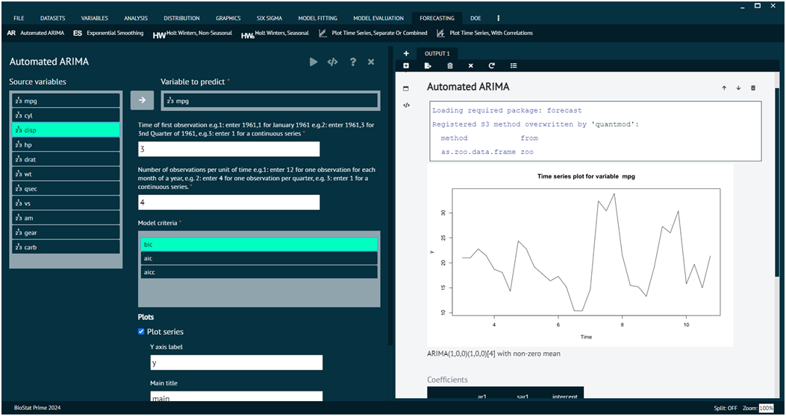

# Automated ARIMA (AR)

ARIMA, which stands for Auto-Regressive Integrated Moving Average, is a popular time series forecasting model in statistics. It combines three components: Auto-Regressive (AR), Integrated (I), and Moving Average (MA). ARIMA models are widely used to analyze and forecast time-series data, where observations are collected at regular intervals over time. Automated ARIMA refers to the process of automatically selecting the best parameters (p, d, q) for the ARIMA model.

This Function returns best ARIMA model according to either AIC, AICc or BIC value. The function conducts a search over possible model within the order constraints provided. Internally calls auto.arima in the forecast package

To analyse it in BioStat Prime user must follow the steps as given.

Steps
: __Load the dataset -> Click on the Forecasting tab in main menu -> Select Automated ARIMA -> Choose variables to predict -> Write Time of first observation -> Write Number of observations per unit of time, choose model criteriaExecute.__

{ width="700" }{ border-effect="rounded" }

## Arguments

vars
: selected variables to build an automatic arima model for.

start
: Time of first observation should be entered in the format year,month or year,quarter e.g.( if your data is organized in months the 1992,1 for Jan 1992 or if your data is organized in quarters then 1992,1 refers to the first quarter of 1992.

frequency
: Number of observations in unit time. Example: for monthly there are 12 observation in a year. For quarterly there are 4 observation in a year.

ic
: Information criterion to be used in model selection. It must be one of "aic", "aicc" or "bic"

plotSeries
: if TRUE a time series plot will also be generated.

plotResiduals
: if TRUE residuals will also be plotted.

predict
: if TRUE predicted values will also be generated.

savePredictedVals
: predicted values will be saved.

PlotPredictedValues
: predicted values will also be plotted.

correlogram
: if TRUE a correlogram will be generated.

main
: main title of the plot

ylab
: title for the y axis

dataset
: the name of the dataset from which the vars have been picked.

>The user can choose additional options like plot options.
