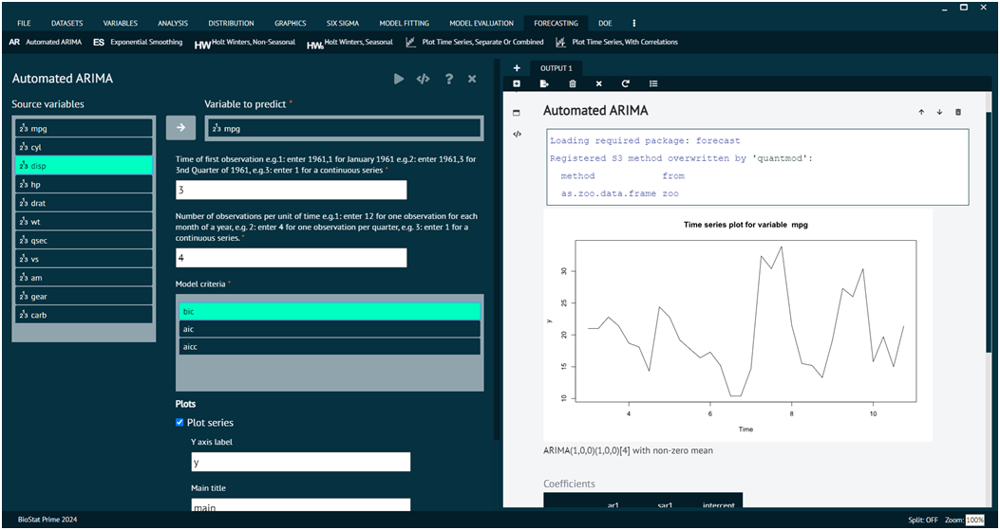

# Automated ARIMA (AR)

ARIMA, which stands for Auto-Regressive Integrated Moving Average, is a popular time series forecasting model in statistics. It combines three components: Auto-Regressive (AR), Integrated (I), and Moving Average (MA). ARIMA models are widely used to analyze and forecast time-series data, where observations are collected at regular intervals over time. Automated ARIMA refers to the process of automatically selecting the best parameters (p, d, q) for the ARIMA model.

To analyse it in BioStat Prime user must follow the steps as given.

__Load the dataset -> Click on the Forecasting tab in main menu -> Select Automated ARIMA -> Choose variables to predict -> Write Time of first observation -> Write Number of observations per unit of time, choose model criteriaExecute.__

{ width="700" }{ border-effect="rounded" }

The user can choose additional options like plot options.
