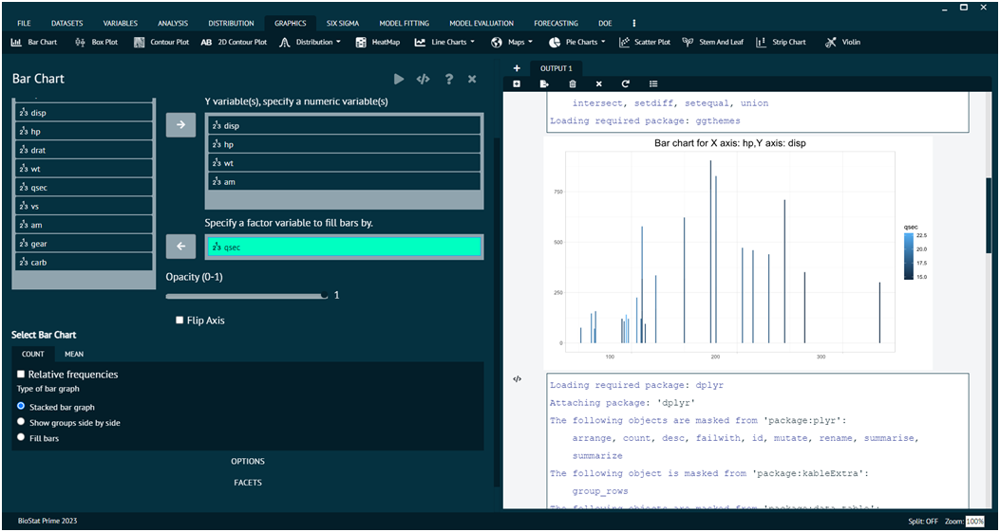

# Bar Chart

For representing any dataset in terms of Bar Chart.

__Load the dataset that needs to be visualized -> Go to Graphics -> Bar Chart -> Put in the values for variables -> Choose additional options (like variable to fill the bars, opacity, count, etc.) as per the user’s requirement -> Execute the dialog.__

The Options tab and Facets tab at the bottom can be utilized to add more features to the bar chart in the output.

The picture below shows the bar chart for a loaded dataset and the dialog for the same.

{ width="700" }{ border-effect="rounded" }
