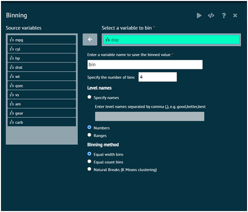
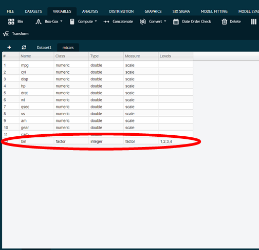

# Bin

Bin function of variable menu selects a variable from the selected dataset to perform binning operation on it. As a result of which the binned value is stored in another variable whose name is determined by the user.

Variable selected to be binned.

{ width="700" }{ border-effect="rounded" }

Variable binned.

{ width="700" }{ border-effect="rounded" }

This tab creates a factor dissecting the range of a numeric variable into bins of equal width, (roughly) equal frequency, or at "natural" cut points (determined by K-means clustering)
