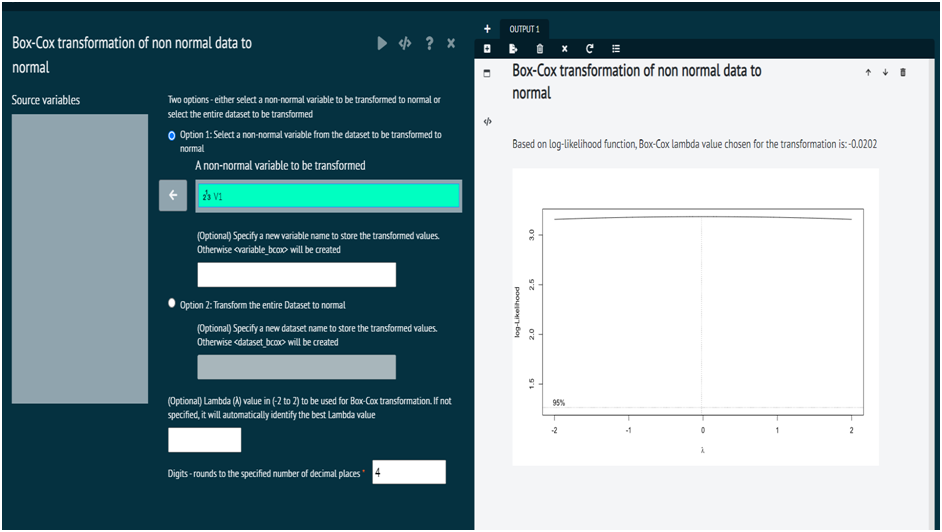
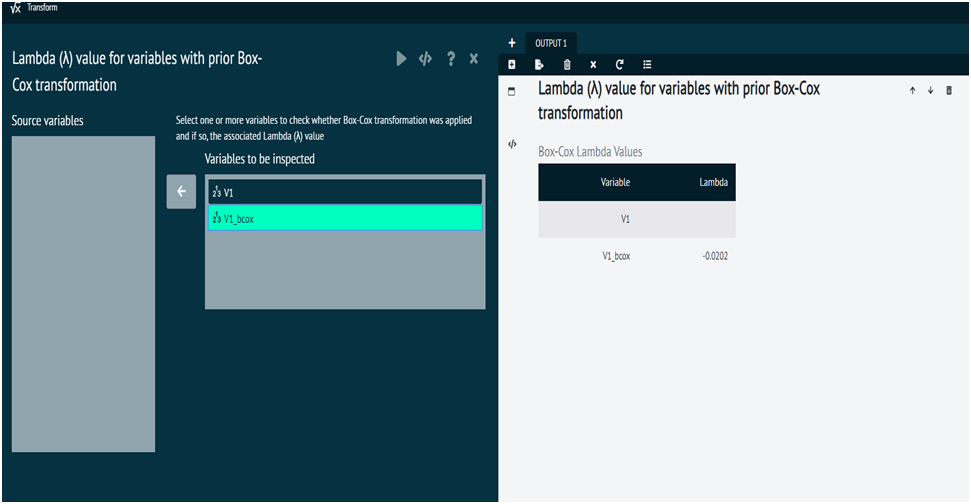
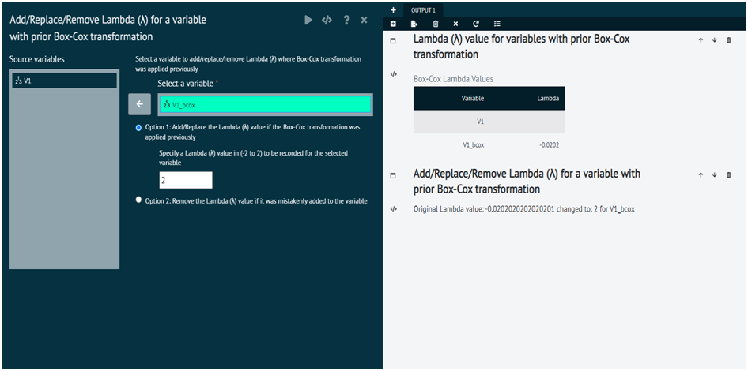
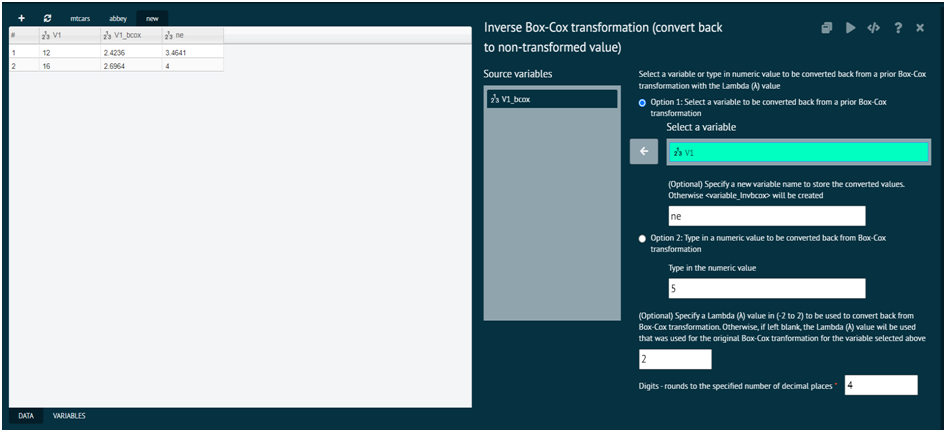

# Box Cox

This section of variable menu aids the user to perform 4 different functions on variables of a given dataset, i.e; box cox transformation inspect lambda, add/remove lambda, reverse box cox.

### Box-Cox Transformation of data of non-normal data to normal
It is a function used to transform non-normal variable to normal with MASS::boxcox
Box-Cox transformation cannot be performed on negative values

>For the detail help - use R help(boxcox, package = MASS)
>
{style="note"}

{ width="700" }{ border-effect="rounded" }

>Lambda (λ) values associated with familiar Box-Cox transformations
>1. λ = 2: square transformation ( x^2 )
>2. λ = 1: no transformation; returns the original data ( x )
>3. λ = 0.50: square root transformation ( sqrt(x) )
>4. λ = 0.33: cube root transformation
>5. λ = 0.25: fourth root transformation
>6. λ = 0: natural log transformation ( log(x) )
>7. λ = - 0.50: reciprocal square root transformation ( 1/sqrt(x) )
>8. λ = - 1: reciprocal (inverse) transformation ( 1/x )
>9. λ = - 2: reciprocal square transformation ( 1/x^2 )

### Inspect Lambda
Checks for the associated Lambda (λ) value, if any, for the selected variables with prior Box-Cox transformation

>For the detail help on Box-Cox or Lambda (λ) - use R help(boxcox, package = MASS)
>
{style="note"}

{ width="700" }{ border-effect="rounded" }

>Lambda (λ) values associated with familiar Box-Cox transformations
>1. λ = 2: square transformation ( x^2 )
>2. λ = 1: no transformation; returns the original data ( x )
>3. λ = 0.50: square root transformation ( sqrt(x) )
>4. λ = 0.33: cube root transformation
>5. λ = 0.25: fourth root transformation
>6. λ = 0: natural log transformation ( log(x) )
>7. λ = - 0.50: reciprocal square root transformation ( 1/sqrt(x) )
>8. λ = - 1: reciprocal (inverse) transformation ( 1/x )
>9. λ = - 2: reciprocal square transformation ( 1/x^2 )

### Add/Remove Lambda
This dialog is provided for convenience if the Lambda (λ) associated with the variable needs to be recorded correctly or adjusted. The correct Lambda (λ) value is important as it will be used if inverse Box-Cox is needed

{ width="700" }{ border-effect="rounded" }

### Inverse Box-Cox
Transform back (inverse) from a prior Box-Cox transformed value using the specified lambda or the lambda associated with the variable selected

{ width="700" }{ border-effect="rounded" }