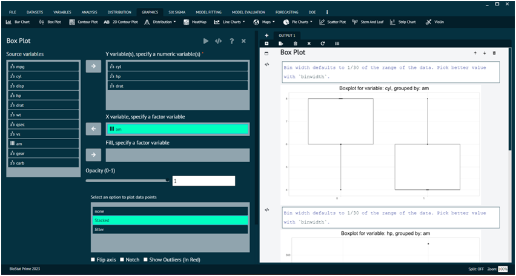

# Box Plot

For representing any dataset in terms of Box Plot.

__Load the dataset that needs to be visualized -> Go to Graphics -> Box Plot ->Put in the values for variables -> Choose additional options (like opacity, data points, flip axis, etc.) as per the user’s requirement -> Execute the dialog.__

User can choose multiple numeric values for Y to have a plot for each value of Y with respect to fixed value of X. Also, the value of X needs to be a factor variable.
The picture below shows the box plot for a loaded dataset and the dialog for the same.

{ width="700" }{ border-effect="rounded" }
