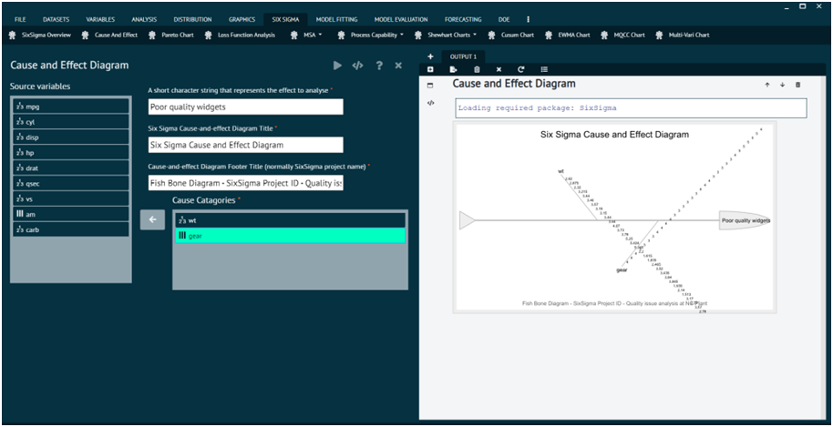

# Cause and Effect

To analyse Cause and Effect in BioStat user must follow the steps given below.

__Load the dataset -> Click on the Six Sigma tab in main menu -> Select Cause and Effect -> This leads to analysis techniques in the dialog -> Select the cause categories from source variables -> Execute and visualise the output in output window.__

{ width="700" }{ border-effect="rounded" }
