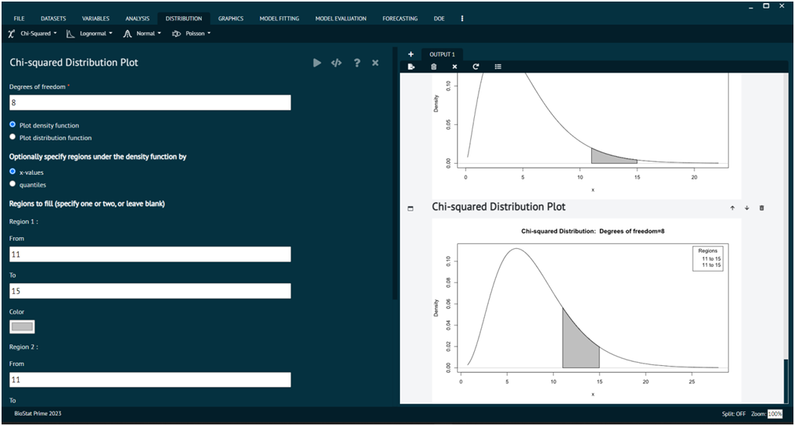
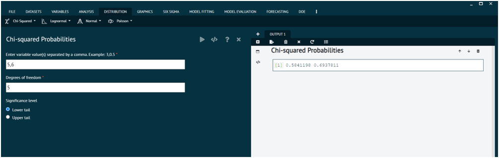
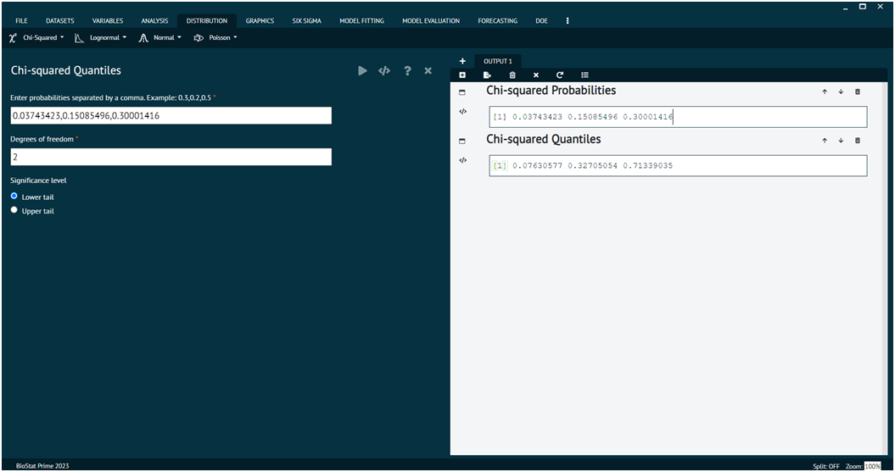
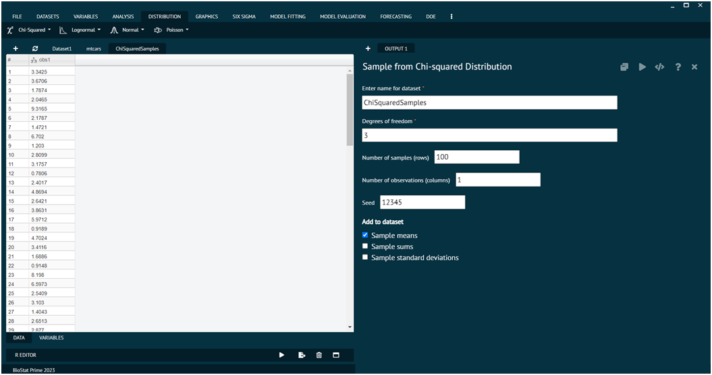
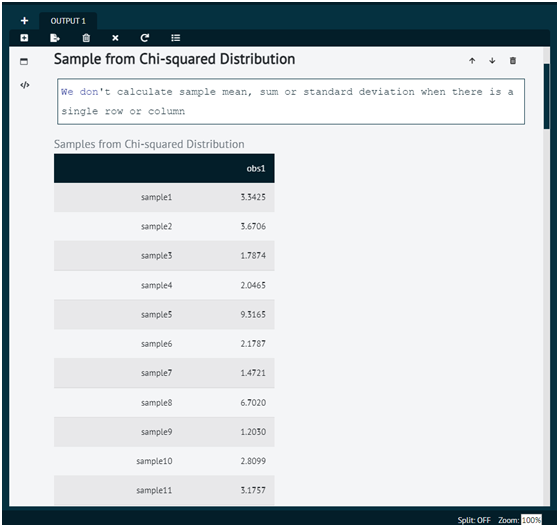

# Chi-square test

The chi-square test, also known as the χ² test (chi-squared test), is a statistical test used to determine if there is a significant association or independence between two categorical variables in a contingency table. Chi-square statistic is calculated from the contingency table to assess the extent of the association. It measures the difference between the observed frequencies (counts) and the expected frequencies (counts) under the assumption of independence. The formula for calculating the chi-square statistic depends on the table's dimensions but generally involves comparing each observed frequency to its expected value and summing up these differences.

### Chi-square Distribution plot

To analyse it in BioStat user must follow the steps as given.

__Load the dataset -> Click on the Distribution tab in main menu -> Select Chi square test -> This leads to analysis technique Chi-square Distribution plot in the dialog -> In the dialog window select the options according to the requirements then execute -> The output will be represented in output window.__

{ width="700" }{ border-effect="rounded" }

### Chi-square Probabilities

To analyse it in BioStat user must follow the steps as given.

__Load the dataset -> Click on the Distribution tab in main menu -> Select Chi square test -> This leads to analysis technique Chi-square Probabilities  in the dialog -> In the dialog window select the options according to the requirements then execute -> The output will be represented in output window.__

{ width="700" }{ border-effect="rounded" }

### Chi-square Quantiles

To analyse it in BioStat user must follow the steps as given.

__Load the dataset -> Click on the Distribution tab in main menu -> Select Chi square test -> This leads to analysis technique Chi-square Quantiles in the dialog -> In the dialog window select the options according to the requirements then execute -> The output will be represented in output window.__

{ width="700" }{ border-effect="rounded" }

### Sample from Chi-square Distribution

To analyse it in BioStat user must follow the steps as given.

__Load the dataset -> Click on the Distribution tab in main menu -> Select Chi square test this leads to analysis technique Sample from Chi-square Distribution in the dialog -> In the dialog window select the options according to the requirements then execute -> The output will be represented in output window.__

{ width="700" }{ border-effect="rounded" }

{ width="700" }{ border-effect="rounded" }
