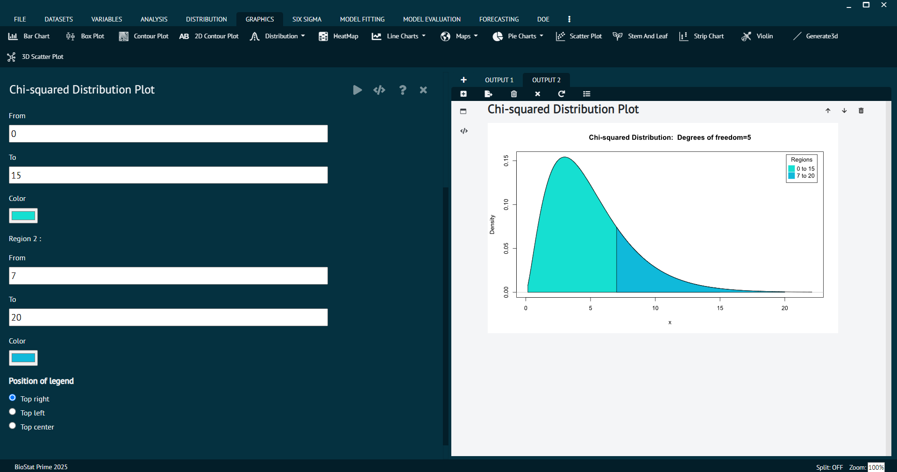

# Chi-square test

The chi-square test, also known as the __χ² test (chi-squared test)__, is a statistical test used to determine if there is a significant association or independence between two categorical variables in a contingency table. 

Chi-square statistic is calculated from the contingency table to assess the extent of the association. It measures the difference between the observed frequencies (counts) and the expected frequencies (counts) under the assumption of independence. 

The formula for calculating the chi-square statistic depends on the table's dimensions but generally involves comparing each observed frequency to its expected value and summing up these differences.

### Chi-square Distribution plot

Density, distribution function, quantile function and random generation for the chi-squared (chi^2) distribution with df degrees of freedom and optional non-centrality parameter ncp.

To analyse it in BioStat user must follow the steps as given.

Steps
: __Load the dataset -> Click on the Distribution tab in main menu -> Select Chi square test -> This leads to analysis technique Chi-square Distribution plot in the dialog -> In the dialog window select the options according to the requirements then execute -> The output will be represented in output window.__

{ width="700" }{ border-effect="rounded" }

#### Usage
>dchisq(x, df, ncp = 0, log = FALSE)
> 
{style=note}

>pchisq(q, df, ncp = 0, lower.tail = TRUE, log.p = FALSE)
> 
{style=note}

>qchisq(p, df, ncp = 0, lower.tail = TRUE, log.p = FALSE)
>
{style=note}

>rchisq(n, df, ncp = 0)
>
{style=note}

#### Value
dchisq gives the density, pchisq gives the distribution function, qchisq gives the quantile function, and rchisq generates random deviates.
Invalid arguments will result in return value NaN, with a warning.

The length of the result is determined by n for rchisq, and is the maximum of the lengths of the numerical arguments for the other functions.
The numerical arguments other than n are recycled to the length of the result. Only the first elements of the logical arguments are used.

>Note
Supplying ncp = 0 uses the algorithm for the non-central distribution, which is not the same algorithm used if ncp is omitted. This is to give consistent behaviour in extreme cases with values of ncp very near zero.

>The code for non-zero ncp is principally intended to be used for moderate values of ncp: it will not be highly accurate, especially in the tails, for large values.

### Chi-square Probabilities

To analyse it in BioStat user must follow the steps as given.

Steps
: __Load the dataset -> Click on the Distribution tab in main menu -> Select Chi square test -> This leads to analysis technique Chi-square Probabilities  in the dialog -> In the dialog window select the options according to the requirements then execute -> The output will be represented in output window.__

{ width="700" }{ border-effect="rounded" }

#### Usage {id="usage_1"}
>dchisq(x, df, ncp = 0, log = FALSE)
>
{style=note}

>pchisq(q, df, ncp = 0, lower.tail = TRUE, log.p = FALSE)
>
{style=note}

>qchisq(p, df, ncp = 0, lower.tail = TRUE, log.p = FALSE)
>
{style=note}

>rchisq(n, df, ncp = 0)
>
{style=note}

#### Value {id="value_1"}
dchisq gives the density, pchisq gives the distribution function, qchisq gives the quantile function, and rchisq generates random deviates.
Invalid arguments will result in return value NaN, with a warning.

The length of the result is determined by n for rchisq, and is the maximum of the lengths of the numerical arguments for the other functions.
The numerical arguments other than n are recycled to the length of the result. Only the first elements of the logical arguments are used.

>Note
Supplying ncp = 0 uses the algorithm for the non-central distribution, which is not the same algorithm used if ncp is omitted. This is to give consistent behaviour in extreme cases with values of ncp very near zero.

>The code for non-zero ncp is principally intended to be used for moderate values of ncp: it will not be highly accurate, especially in the tails, for large values.

### Chi-square Quantiles

To analyse it in BioStat user must follow the steps as given.

Steps
: __Load the dataset -> Click on the Distribution tab in main menu -> Select Chi square test -> This leads to analysis technique Chi-square Quantiles in the dialog -> In the dialog window select the options according to the requirements then execute -> The output will be represented in output window.__

{ width="700" }{ border-effect="rounded" }

### Sample from Chi-square Distribution

To analyse it in BioStat user must follow the steps as given.

Steps
: __Load the dataset -> Click on the Distribution tab in main menu -> Select Chi square test -> this leads to analysis technique Sample from Chi-square Distribution in the dialog -> In the dialog window select the options according to the requirements then execute -> The output will be represented in output window.__

{ width="700" }{ border-effect="rounded" }

{ width="700" }{ border-effect="rounded" }
