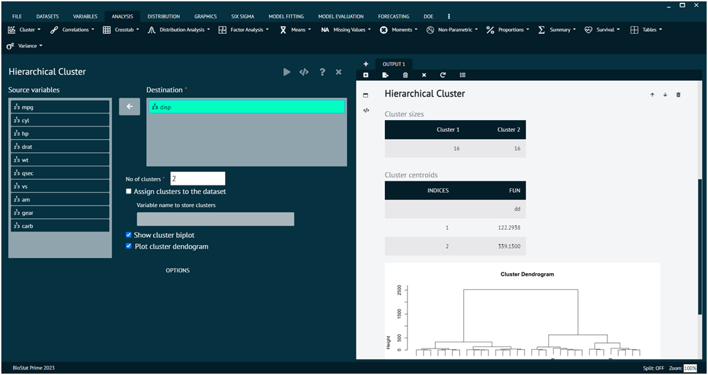
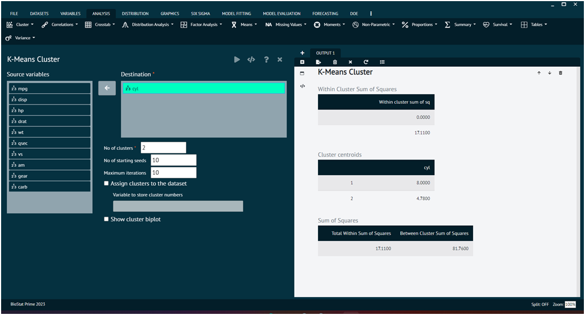

# Cluster

In statistics, clustering is a technique used to group similar data points into clusters or groups based on certain criteria. The goal of clustering is to identify patterns or structures within a dataset by grouping data points that are similar to each other than to those in other clusters. There are various clustering algorithms, each with its own approach to defining similarity and forming clusters. BioStat Prime comes up with a platform to perform the algorithms to aid users in their analysis.

### Hierarchical Clustering

Hierarchical clustering builds a hierarchy of clusters, creating a tree-like structure (dendrogram) that shows the relationships between clusters at different levels.

To analyse it in BioStat Prime user must follow the steps as given.

__Load the dataset -> click on the analysis tab in main menu select CLUSTER button -> select Hierarchical Cluster -> this leads to the analysis technique in the dialog -> select the source variable -> write no. of clusters values -> Execute the dialog.__

The result of the analysis will be visible in the output.Users can also decide whether to assign cluster values to dataset, plot cluster dendrogram, show cluster bi plot. The options tab at the bottom leads the user to further methods and metrics that the user can choose according to the requirements.

{ width="700" }{ border-effect="rounded" }

### K-Means Clustering

K-Means is a popular partition clustering algorithm that aims to partition data into K clusters. It iteratively assigns data points to clusters and updates cluster centroids until convergence.Partition clustering divides the data into non-overlapping clusters in a single step.

To analyse it in BioStat Prime user must follow the steps as given.

__Load the dataset -> click on the analysis tab in main menu select CLUSTER button -> select K-Means Cluster -> This leads to the analysis technique in the dialog -> Select the source variable -> Write no. of clusters values -> Execute the dialog.__

The result of the analysis will be visible in the output. User can also decide whether to assign cluster values to dataset, show cluster bi plot, no. of starting seeds, maximum iterations.

{ width="700" }{ border-effect="rounded" }
