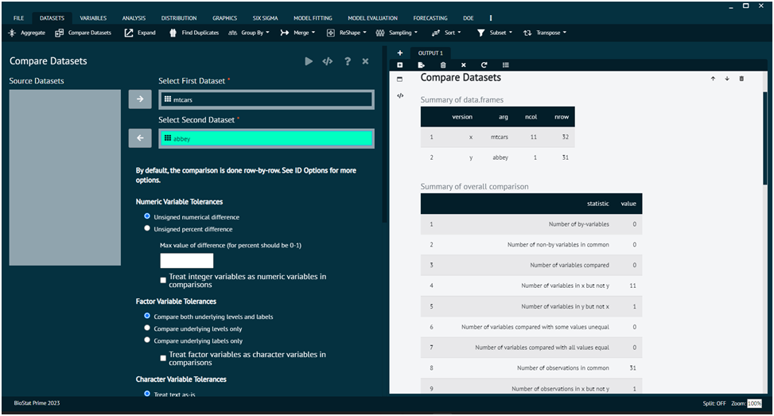

# Compare Dataset

Compares two datasets and reports any differences between them. It will Compare the datasets that will help the user to compare two datasets. 

>By default, the comparison is done row by row.
>
{style="note"}

To compare datasets user needs to follow the steps given bellow.

{type="full"}
Steps
:
__Load the dataset -> click on the DATASET tab in main menu -> select Compare Dataset -> Once the dialog appears choose the datasets to be compared-> Execute the dialog.__

Output of comparison is given as.

{ width="700" }{ border-effect="rounded" }

The various options present in this dialog are explained as under.

## Numeric Variable Tolerance Options

### Unsigned numerical difference (default)
Assesses whether 2 values are different by taking the absolute value of the difference and testing if it is larger than the max value of difference value

>Example: age = 18.5 vs. age = 18.8
difference = | 18.5 - 18.8 | = | -0.3 | = 0.3

### Unsigned percent difference
Assesses whether 2 values are different by taking the absolute value of the percent difference and testing if it is larger than the max value of difference value

>Example: age = 18.5 vs. age = 18.8
difference = | 18.5 - 18.8 | / 18.8 = | -0.3 | / 18.8 = 0.3 / 18.8 = 0.0160

### Max value of difference (blank by default)
If blank, values should be identical (as best detected by your system). Otherwise, enter a value > 0 that will be used to determine if the difference is large enough to be called different.

>Example 1 with numerical difference: age = 18.5 vs. age = 18.8 and max value = 0.2
difference = | 18.5 - 18.8 | = | -0.3 | = 0.3 since 0.3 > 0.2, this would be flagged as different

>Example 2 with numerical difference: age = 18.5 vs. age = 18.6 and max value = 0.2
difference = | 18.5 - 18.6 | = | -0.1 | = 0.1 since 0.1 < 0.2, this would not be flagged as different

>Example 1 with percent difference: age = 18.5 vs. age = 18.8 and max value = 0.01
difference = | 18.5 - 18.8 | / 18.8 = | -0.3 | / 18.8 = 0.3 / 18.8 = 0.0160 since 0.016 > 0.01, this would be flagged as different

>Example 2 with percent difference: age = 18.5 vs. age = 18.8 and max value = 0.01
difference = | 18.5 - 18.6 | / 18.8 = | -0.1 | / 18.8 = 0.1 / 18.8 = 0.0005 since 0.0005 < 0.01, this would not be flagged as different

### Treat integer variables as numeric variables in comparisons
Should variables with class integer be compared to variables with class numeric? User may end up with variables of different classes when user reads in data from external sources (like Excel)

>Example: age (integer) = c(18, 33, 45) vs. age (numeric) = c(18.6, 33.4, 45.1)
If you want the values of these 2 variables compared between the data sets, check this box. By default, the system only compares numeric variables of the same class.

## Factor Variable Tolerance Options

### Compare both underlying levels and labels (default)
Compares both the stored values (1,2,3) and labels (mild, moderate, severe) between the variables

>Example 1: disease (1 = mild, 2 = moderate, 3 = severe) vs. disease (1 = mild, 2 = severe)
These 2 variables would be considered different because the 2 = moderate in 1st variable but 2 = severe in the 2nd variable

>Example 2: disease (1 = mild, 2 = moderate, 3 = severe) vs. disease (1 = mild, 2 = moderate, 3 = sev)
These 2 variables would be considered different because the 3 = severe in 1st variable but 3 = sev in the 2nd variable

### Compare underlying levels only
Compares only the underlying levels (1,2,3) across factor variables

>Example 1: disease (1 = mild, 2 = moderate, 3 = severe) vs. disease (1 = mild, 2 = severe)
These 2 variables would not be considered different because the underlying values 1,2,3 in the 1st variable are the same as the values 1,2 are in the 2nd variable.

>Example 2: disease (1 = mild, 2 = moderate, 3 = severe) vs. disease (1 = mild, 2 = moderate, 3 = sev)
These 2 variables would be considered different because the 3 = severe in 1st variable but 3 = sev in the 2nd variable

### Compare underlying labels only
Compares only the underlying labels (mild, moderate, severe) across factor variables

>Example 1: disease (1 = mild, 2 = moderate, 3 = severe) vs. disease (1 = mild, 2 = severe)
These 2 variables would not be considered different because the labels are the same

>Example 2: disease (1 = mild, 2 = moderate, 3 = severe) vs. disease (1 = mild, 2 = moderate, 3 = sev)
These 2 variables would be considered different because the 3 = severe in 1st variable but 3 = sev in the 2nd variable so the labels are different

### Treat factor variables as character variables in comparisons
Checks if factors should be converted to character variables using their labels for the comparison. You may end up with discrepant classes if you read data from different sources.

>Example: disease (factor with 1 = mild, 2 = moderate, 3 = severe) vs. disease (character with mild, moderate, severe)
To compare these variables, check the box to convert the 1st variable to a character variable.

## Character Variable Tolerance Options

### Treat text as-is (default)
Text is compared exactly as presented including any differing spaces or upper/lowercase differences.

>Example (note that . means a space): name = John vs. name = john
These would be different since J is different from j

### Ignore differences in upper/lowercase
Ignore case differences when doing the comparison

>Example (note that . means a space): name = John vs. name = john
These would not be different since J is now not different from j

### Ignore differences in leading/trailing whitespace
Remove any leading/trailing whitespace before doing the comparison

>Example (note that . means a space): name = john vs. name = john...
By default, john is different from john... but selecting this option would make john = john... because the ... would get removed prior to the comparison

### Ignore differences in both case and whitespace
Ignore both case and whitespace as described above

## Variable Name Tolerance Options

### Treat variable names as-is (default)
Upper/lowercase, spaces, dots, and underscores mean variables are different

>Example: Variable = Age would not be compared to Variable = age using this option

### Treat dots, underscores, and spaces equivalent in variable names
Ignore dots, underscores, and spaces in variable names

>Example: Variable = Age.dx would be compared to Age_dx if you select this option. By default, they would not be treated as the same variable

### Ignore upper/lowercase in variable names
Ignore differences in upper/lowercase in variable names

>Example: Variable = Age would be compared to Variable = age using this option

### Ignore case and treat dots, underscores, and spaces equivalent in variable names
Ignore differences in dots, underscores, spaces, and upper/lowercase as described above

>Example: Variable = Age.dx would be compared to Variable = age_dx using this option

>Required R Packages: arsenal
>
{style="note"}