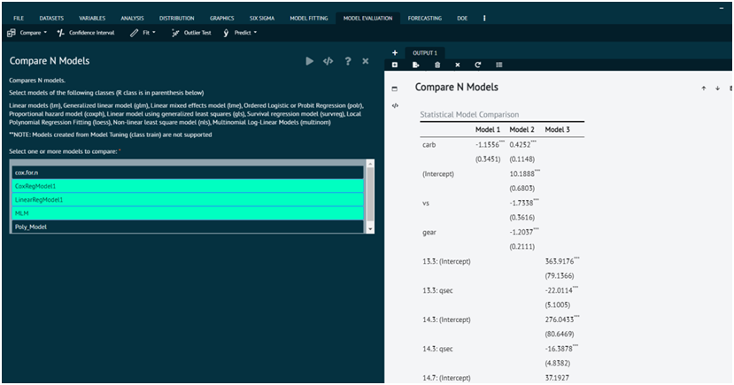

# Compare N Models

This function compares 2 nested modes using a F or a Chi-sq test depending on estimation. F tests are used for least squares estimation, chi-sq test are used for maximum likelihood estimation. Both models should be created on the same dataset as differences in missing values can cause problems

{ width="700" }{ border-effect="rounded" }

>The comparison between two or more models will only be valid if they are fitted to the same dataset. This may be a problem if there are missing values and R's default of na.action = na.omit is used.
>
{style="warning"}