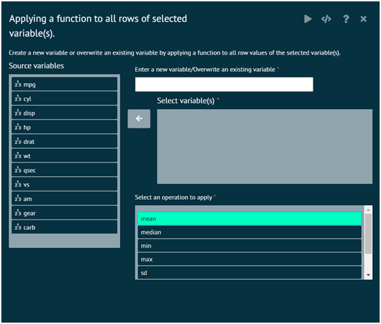
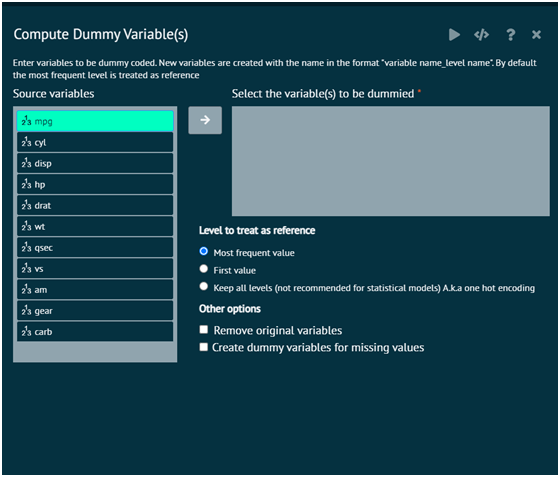
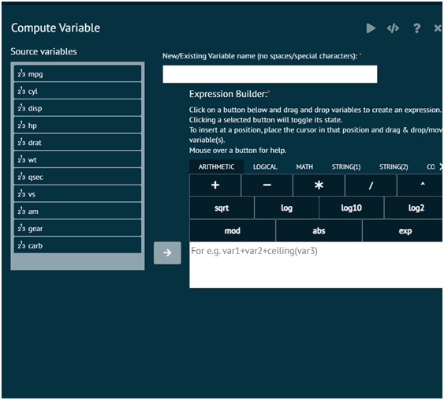
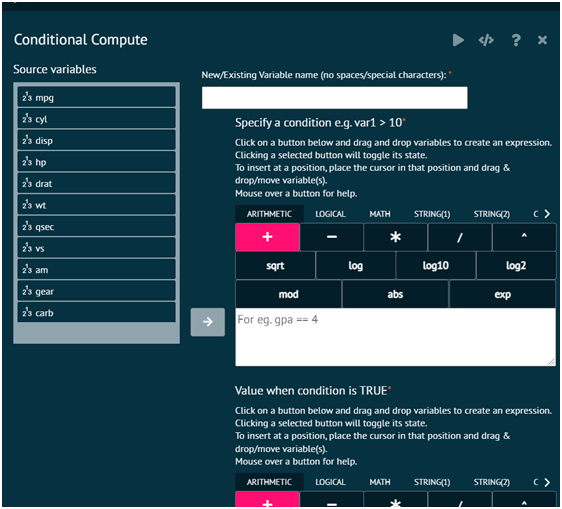
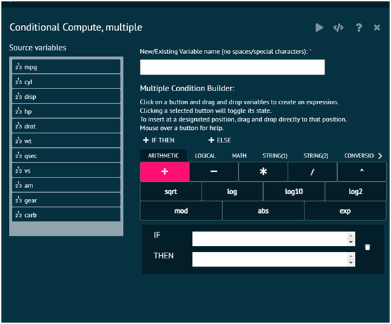
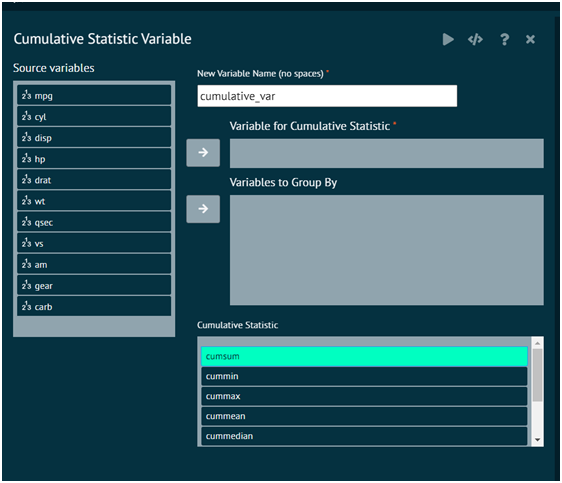

# Compute

Compute aids the user to compute the variable rows and save the output in a new row.

### Applying Function to all Rows
Applies a function across all rows of the selected variables (columns) in a dataset. User can use the select function and the pipe ( %>% ) operator from the dplyr package to select the variables whose rows we will apply a function to. (These variables are piped into the apply function)

{ width="700" }{ border-effect="rounded" }

>Computed values are stored directly in Dataset Package : dplyr
>
{style="note"}

### Dummy code
In this section variables entered are dummy coded. New variables are created with the name in the format "variable name_level name". 

{ width="700" }{ border-effect="rounded" }

>By default the most frequent level is treated as reference
>
{style="note"}

### Compute Variable
Computes an expression and stores the result in a variable/column of a dataframe/dataset.

{ width="700" }{ border-effect="rounded" }

The arguments used is executing the dialog are given as follows.

>Arguments
>1. DatasetX: dataframe/dataset name.​
>2. var1: The new/existing column in the dataset/dataframe that needs to be computed
>3. Expression: An expression in the form variable1 =variable2+variable3

### Conditional Compute

{ width="700" }{ border-effect="rounded" }

### Conditional Compute Multiple

{ width="700" }{ border-effect="rounded" }

### Cumulative Statistics Variable
This dialog creates a new variable that stores the cumulative value of a chosen statistic as you go down the rows in the current order of the dataset. User can optionally compute this cumulative value within one or more groups.

{ width="700" }{ border-effect="rounded" }

__.New Variable Name__: Name of variable that will store the cumulative values

__Variable for Cumulative Statistic__: Variable for which the cumulative values will be computed. Must be numeric.

__Variables to Group By__: Optional variables to compute the cumulative statistic within.

__Cumulative Statistic__: Which statistic will be used for the cumulative statistic.

cumsum
: cumulative sum

cummin
: cumulative minimum

cummax
: cumulative maximum

cummean
: cumulative mean

cummedian
: cumulative median

cumgmean
: cumulative geometric mean

cumhmean
: cumulative harmonic mean

cumvar
: cumulative variance

>Required R Packages: cumstats, dplyr
>
{style="note"}
