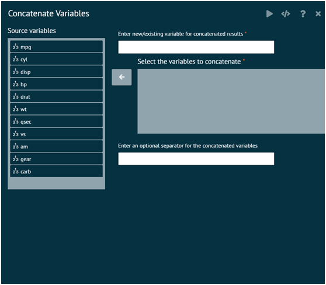

# Concatenate
Create a factor dissecting the range of a numeric variable into bins of equal width, (roughly) equal frequency, or at "natural" cut points (determined by K-means clustering)

{ width="700" }{ border-effect="rounded" }