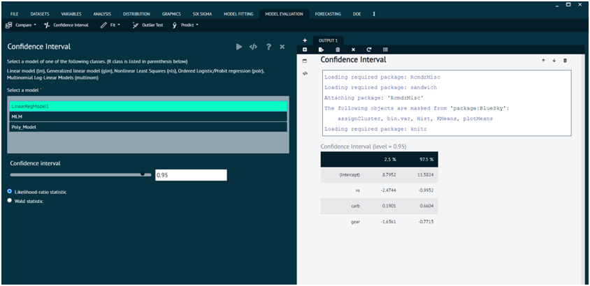

# Confidence Interval

A confidence interval (CI) is a statistical concept used to estimate a range of values within which a population parameter is likely to fall. It provides a measure of the uncertainty or variability associated with estimating a population parameter from a sample of data. Confidence intervals are commonly used in inferential statistics, hypothesis testing, and research to make inferences about a population based on sample data.

To analyse it in BioStat Prime user must follow the steps as given.

Steps
: __Load the dataset -> Click on the model evaluation tab in main menu -> Select confidence interval -> Select a model -> Execute.__

{ width="700" }{ border-effect="rounded" }
