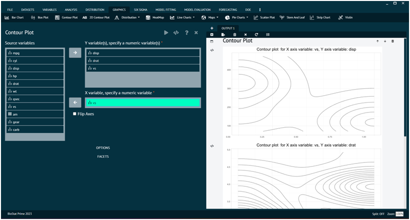
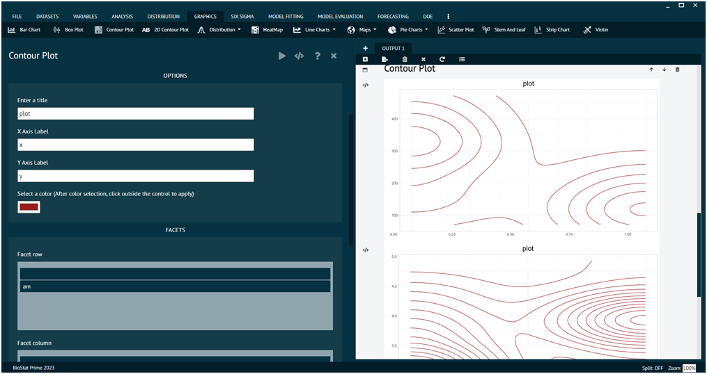

# Contour Plot

For representing any dataset in terms of Contour Plot.

Steps
: __Load the dataset that needs to be visualized -> Go to Graphics -> Contour Plot -> Put in the values for variables -> Choose additional options (like opacity, data points, flip axis, etc.) as per the user’s requirement -> Execute the dialog.__

{ width="700" }{ border-effect="rounded" }

>User can choose multiple numeric values for Y to have a plot for each value of Y with respect to fixed numeric value of X.
>
{style="note"}

The Options tab and Facets tab at the bottom can be utilized to add more features to the output as shown below.

{ width="700" }{ border-effect="rounded" }
