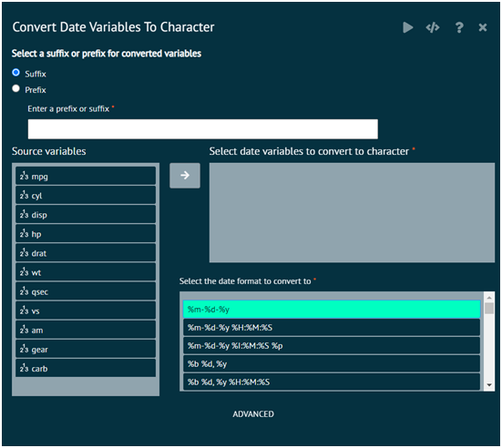
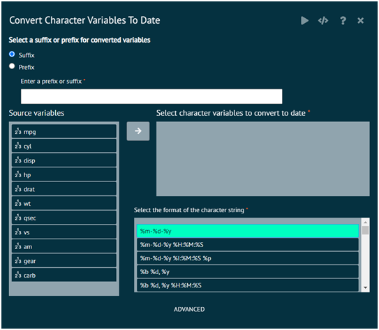
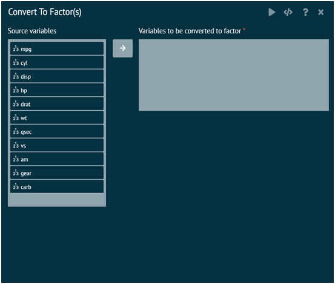
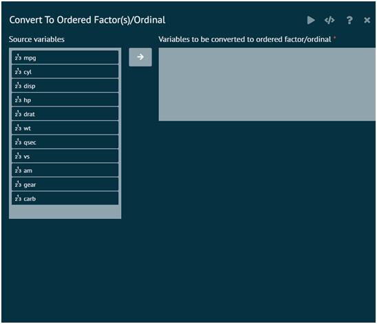

# Convert

Convert section of variable menu aids the user to convert a character variable to date, to factor, to ordered factor and vice versa.

### Date to Character
Converts date (posixct and date class) to character -to control the format in which the date is displayed. User can specify as input the format in which the string should be generated i.e. year/month/Day or month-dat=year etc. 

The function above internally calls strftime in the base package. 

>BioStat Prime has extended strftime to support multiple variables.
>
{style="note"}

{ width="700" }{ border-effect="rounded" }

### Character to Date
Converts a character to a date (POSIXct class). User needs to specify the format of the date stored in a character string.

{ width="700" }{ border-effect="rounded" }

### Convert to Factor
The function factor is used to encode a vector as a factor (the terms ‘category’ and ‘enumerated type’ are also used for factors). If argument ordered is TRUE, the factor levels are assumed to be ordered. For compatibility with S there is also a function ordered. is.factor, is.ordered, as.factor and as.ordered are the membership and coercion functions for these classes.

{ width="700" }{ border-effect="rounded" }

### Convert to ordered factor/ordinal
The function factor is used to encode a vector as a factor (the terms ‘category’ and ‘enumerated type’ are also used for factors). If argument ordered is TRUE, the factor levels are assumed to be ordered. For compatibility with S there is also a function ordered. is.factor, is.ordered, as.factor and as.ordered are the membership and coercion functions for these classes.

{ width="700" }{ border-effect="rounded" }
