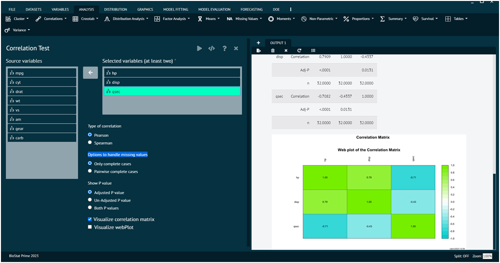

# Correlations

Correlation in statistics refers to the statistical relationship or association between two or more variables. The goal of correlation analysis is to measure the strength and direction of a linear relationship between variables. It quantifies how changes in one variable are associated with changes in another variable. 

BioSat Prime provides the user with the functionality to access this relationship by virtue of __Pearson,Spearman test__.

### Pearson, SpearmanCorrelation

The Pearson correlation test and the Spearman correlation test are statistical methods used to assess the strength and direction of the relationship between two variables. However, they differ in terms of the types of relationships they can detect and the assumptions they make about the data. 

>While the Pearson correlation assesses linear relationships between continuous variables, the Spearman correlation is a non-parametric measure that assesses monotonic relationships, making it more robust in certain situations, especially when dealing with non-normally distributed or ordinal data. 

>The choice between them depends on the nature of the data and the type of relationship user wants to explore.

This function uses the `rcorr` function in the `Hmisc` package to compute matrices of Pearson or Spearman correlations along with the pair wise `p-values` among the correlations. 
The p-values are corrected for multiple inference using `Holm's method` (see p.adjust). 

>Observations are filtered for missing data, and only complete observations are used.

{ width="700" }{ border-effect="rounded" }

To analyse it in BioStat Prime user must follow the steps as given.

Steps
: __Load the dataset -> Click on the analysis tab in main menu -> Select correlation -> Select the option namely pearson, seaman -> This leads to the analysis technique in the dialog -> Select the type of correlation in dialog -> Adjust the P value via selecting proper options -> Choose options to handle missing values -> Execute the dialog.__

The result of the analysis will be visible in the output. User can also visualise the output by opting for __visualise option in dialog__. 

>Note that stronger the colour in the output stronger is the correlation.
>
{style="note"}