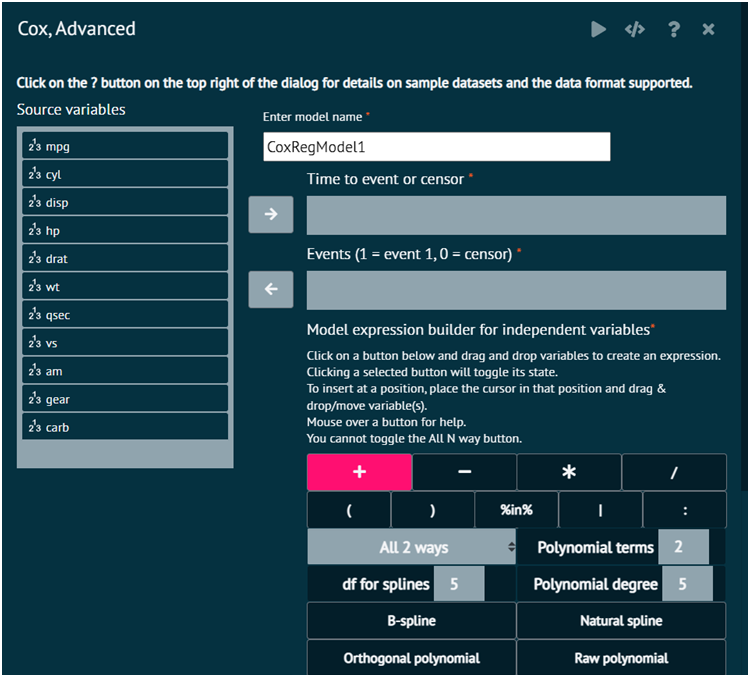

# Cox, Advanced

Cox proportional hazards model, often called the Cox model, this model is widely used in the analysis of survival data to investigate the effect of explanatory variables on the time a specified event takes to occur.

## Cox Proportional Hazards Model

Fits a Cox proportional hazards model for time-to-event data with censored observations. Model fitting statistics, parameter estimates, and hazard ratios are provided. Options available include the __tied time method__, __model diagnostics__ such as __proportional hazards__ and __covariate functional form assessments__, and a __forest plot of hazard ratios with confidence intervals__. The model is fit using the `coxph` function in the survival package.

To analyse it in BioStat Prime user must follow the steps as given.

Steps
: __Load the dataset -> click on the Model Fitting tab in main menu -> Select Regression -> This leads to analysis techniques, choose Cox Advanced -> There will appear a dialog, Select the source variables to enter in Time to event or censor and Events (1 = event 1, 0 = censor) options in the dialog -> Populate a formula with formula builder -> Finally execute.__

> Using Formula Builder: A Guide
>1.	To create an expression, click one of the buttons below and drag & drop variables.
>2.	Toggle the selected button's state by clicking it.
>3.	Place the cursor where user wants to insert the variable(s) and drag and drop or move it there.
>4.	Touch a button to see assistance.
>5.	The All N way button is not able to be toggled.

{ width="700" }{ border-effect="rounded" }

## Arguments

Time
: Time to event for those experiencing the event or time to last follow-up for those not experiencing the event

Event
: Numerical event indicator; 1=event, 0=censor

Independent Variables
: Independent variables to include in the model. Factors, strings, and logical variables will be dummy coded.

Weights
: Numeric variable for observation weights. Useful in situations where each record should not be counted as one observation.

Required packages
: survival, broom, survminer, car, BlueSky

>Click the Get R Help button to get detailed R help about the coxph function.
> 
{style="note"}

## Options

Tied Time Method
: Method of breaking tied observed times. Efron is usually the better choice when there aren't many tied times. The exact method can be beneficial if there are many tied times, as in discrete time situations, but can take a little longer for the model to be fit.

Forest Plot
: Plot of hazard ratios and confidence intervals for each predictor in the model.

Model Diagnostics
: If selected, proportional hazards tests and plots will be provided, in addition to assessments of functional form for each covariate in the model. The null model Martingale residual axis minimum value option might need to be changed so that all residuals appear in the plot. To get functional form assessments, you must specify only numeric predictors and have no missing data. See Variables > Missing Values > Remove NAs.

Analysis of Deviance (Type II)
: Global test of each predictor in the model. Multi-degree of freedom tests will be provided for effects with more than 2 levels. Wald and Likelihood ratio tests can be obtained, with likelihood ratios tests having better small sample properties.