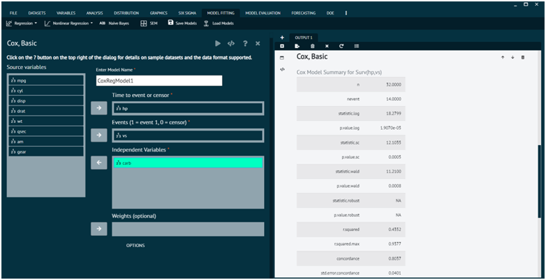

# Cox, Basics

The Cox proportional hazards model is used to analyze and interpret the effect of several variables on the time it takes for a particular event to occur. This event could be anything that marks the end of a period, such as death, failure, recovery, or relapse.

The Cox proportional hazards model is extensively used in medical research, particularly in studies of treatment efficacy, clinical trials, and epidemiological research. It is also used in various fields where time-to-event data is relevant.

To analyse it in BioStat Prime user must follow the steps as given.

Steps
: __After loading the dataset, select Regression from the Model Fitting tab in the main menu -> This will lead to analytic approaches; select Cox Basics -> A dialog box will then display. In the dialog, select the source variables that need to be established as independent variables -> Lastly, choose which source variables to insert in the Time to event or censor, Events (1 = event 1, 0 = censor) options. -> Finally execute.__

{ width="700" }{ border-effect="rounded" }

>Click on the ? button on the top right of the dialog for details on sample datasets and the data format supported.
> 
{style="note"}

## Arguments

Time
: Time to event for those experiencing the event or time to last follow-up for those not experiencing the event

Event
: Numerical event indicator; 1=event, 0=censor

Independent Variables
: Independent variables to include in the model. Factors, strings, and logical variables will be dummy coded.

Weights
: Numeric variable for observation weights. Useful in situations where each record should not be counted as one observation.

Required packages
: survival, broom, survminer, car, BlueSky

>Click the Get R Help button to get detailed R help about the coxph function.
>
{style="note"}

## Options

Tied Time Method
: Method of breaking tied observed times. Efron is usually the better choice when there aren't many tied times. The exact method can be beneficial if there are many tied times, as in discrete time situations, but can take a little longer for the model to be fit.

Forest Plot
: Plot of hazard ratios and confidence intervals for each predictor in the model.

Model Diagnostics
: If selected, proportional hazards tests and plots will be provided, in addition to assessments of functional form for each covariate in the model. The null model Martingale residual axis minimum value option might need to be changed so that all residuals appear in the plot. To get functional form assessments, you must specify only numeric predictors and have no missing data. See Variables > Missing Values > Remove NAs.

Analysis of Deviance (Type II)
: Global test of each predictor in the model. Multi-degree of freedom tests will be provided for effects with more than 2 levels. Wald and Likelihood ratio tests can be obtained, with likelihood ratios tests having better small sample properties.