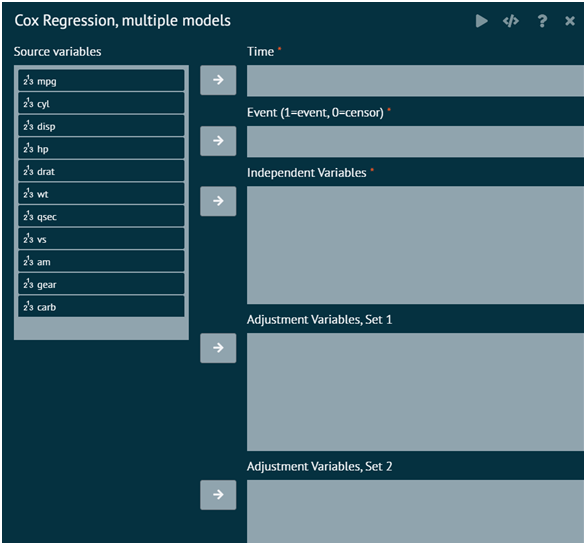

# Cox Regression, Multiple models

This creates a table containing results from Cox regression models for provided time and event variables. Separate Cox regression models will be fit for each independent variable, optionally adjusted for a set of additional variables. If a strata variable is specified, separate models will be fit for each of the stratification variable values. As an example, if no adjustor or stratification variables are specified, then the table will include all univariate models for the list of independent variables. Various statistics from each model can be output.

{ width="700" }{ border-effect="rounded" }

__Attributes__

Time
: Time variable for each Cox regression model. The variable class must be a numeric type.

Event (1=event, 0=censor)
: Event variable for each Cox regression model. A value of 1 indicates the event occurred and 0 indicates the event did not occur. The variable class must be a numeric type.

Independent Variables
: Independent variables to include in the models. The variable classes can be a numeric type, character, factor, or ordered factor.

Adjustment Variables (Sets 1-5)
: Optional variables to be included in a model with the independent variables. The variable classes can be a numeric type, character, factor, or ordered factor. Specifying more than one set of adjustor variables will provide separate models with each set of adjustor variables.

Strata
: Optional stratification variable. Separate models will be fit for the subset defined by each of the stratification variable values. The variable class can be character, numeric, factor, or ordered factor.

Weights
: Optional case-weights to be used in the models. Specifying a weights variable will fit weighted regression models.

__Digits After Decimal__
Continuous Values
: The number of decimal places to show for all continuous values in the table (default=4)
P-Values
: The number of decimal places to show for all p-values in the table (default=4)
Hazard Ratios
: The number of decimal places to show for all hazard ratios in the table (default=4)

### Options

#### Parameter Estimates and Hazard Ratios
Parameter Estimates
: Show parameter estimates (coefficients) from each model.

Standard Errors
: Show standard errors of the parameter estimates.

Confidence Interval Level
: Level for the parameter estimate and hazard ratio confidence intervals (default=0.95).

Parameter Wald Confidence Intervals
: Show Wald-based confidence intervals for the parameter estimates.

Hazard Ratios
: Show hazard ratios for each parameter estimate (exp(coefficient)).

Hazard Ratios Wald Confidence Intervals
: Show Wald-based confidence intervals for the hazard ratios.

Adjustment Variables
: Show model output for the adjustment variables.

Adjustment Names
: Show a column delineating model types (unadjusted and different adjustment variable sets). Mostly useful when you don't want to show model output for the adjustor variables.

#### Sample Size
Sample Size
: Show the sample size used from each model.

Number Missing, if any
: Show the number of observations not used in each model (missing values), only if there are some not used.

Number Missing, always
: Show the number of observations not used in each model (missing values), regardless of whether there are some observations not used.

Number of Events
: Show the number of events from each model.

#### Fit Statistics
Concordance
: Show the model concordance statistic.

Concordance Standard Error
: Show the standard error of the model concordance statistic.

R-Squared
: Show a pseudo R-squared value from each model (Nagelkerke's R-squared)

R-Squared Maximum
: Show the maximum possible value for the pseudo R-squared value from each model (Nagelkerke's R-squared)

Akaike Information Criterion (AIC)
: Show the model Akaike Information Criterion

Bayesian Information Criterion (BIC)
: Show the model Bayesian Information Criterion

Log-Likelihood
: Show the model log-likelihood value

#### P-Values
Parameter Estimates (Wald Test)
: Show the p-values from the individual parameter Wald tests

Likelihood Ratio Tests (not adjustors)
: Show the p-values for each independent variable based on a likelihood ratio test. This compares a model with the independent variable to a model without the independent variable, including any adjustor variables in both models.

Model Score Test
: Show the p-value from the overall model score test.

Model Likelihood Ratio Test
: Show the p-value from the overall model likelihood ratio test.

Model Wald Test
: Show the p-value from the overall model Wald test.

#### Test Statistics
Parameter z-statistics (Wald Test)
: Show the z-statistics from the individual parameter Wald tests.

Model Score Test
: Show the overall model score statistic.

Model Likelihood Ratio Test
: Show the overall model likelihood ratio test statistic.

Model Wald Test
: Show the overall model Wald test statistic.

>Required R Packages: arsenal, survival, dplyr
>
{style="note"}