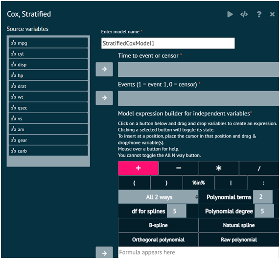

# Cox, Stratified

Fits a stratified Cox proportional hazards model for time-to-event data with censored observations. This is a Cox model that allows a separate baseline hazard function for each strata level. Model fitting statistics, parameter estimates, and hazard ratios are provided. Options available include the tied time method and model diagnostics. The model is fit using the coxph function in the survival package.

To analyse it in BioStat Prime user must follow the steps as given.

Steps
: __Load the dataset -> Click on the Model Fitting tab in main menu -> Select Regression -> This leads to analysis techniques, choose Cox, Stratified -> There will appear a dialog -> Select the model name, time to event or sensor, events, populate a formula and select Stratification variables in the dialog -> Finally execute the plot and visualise the output in output window.__

{ width="700" }{ border-effect="rounded" }

> Using Formula Builder: A Guide
>1.	To create an expression, click one of the buttons below and drag & drop variables.
>2.	Toggle the selected button's state by clicking it.
>3.	Place the cursor where user wants to insert the variable(s) and drag and drop or move it there.
>4.	Touch a button to see assistance.
>5.	The All N way button is not able to be toggled.

### Attributes

Time to event or censor
: Time to event for those experiencing the event or time to last follow-up for those not experiencing the event

Events (1=event, 0=censor)
: Numerical event indicator; 1=event, 0=censor

Formula Builder
: Construct terms to include in the model. Factors, strings, and logical variables will be dummy coded. The provided buttons allow you to specify main effects, full factorial effects (main effects and all interactions with the involved variables), polynomials, specific interactions, and delete terms from the list. Interactions with stratification variables is allowed.

Stratification Variables
: Specify one or more stratification variables. These can be numeric, factor, ordered factor, or character variables. The strata divide the subjects into separate groups whereby each group has a distinct baseline hazard function. If multiple stratification variables are given, a separate baseline hazard function is used for every combination of stratification variable levels.

Weights
: Numeric variable for observation weights. Useful in situations where each record should not be counted as one observation.

>Required packages: survival, broom, survminer
>
{style="note"}

>Click the R Help button to get detailed R help about the coxph function.
>
{style="note"}

### Options

Tied Time Method
: Method of breaking tied observed times. Efron is usually the better choice when there aren't many tied times. The exact method can be beneficial if there are many tied times, as in discrete time situations, but can take a little longer for the model to be fit.

Model Diagnostics
: If selected, proportional hazards tests and plots will be provided, in addition to a Martingale residual plot.