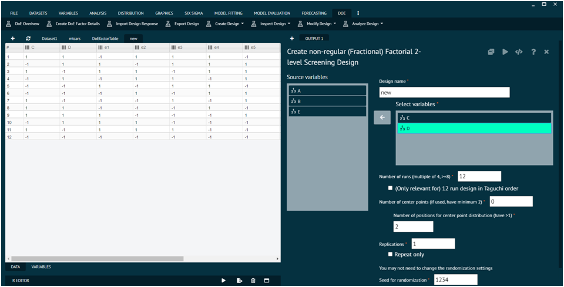
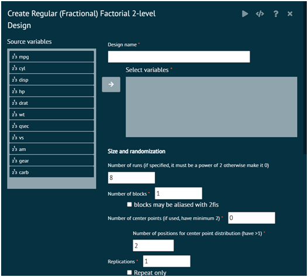
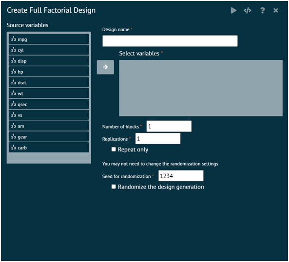
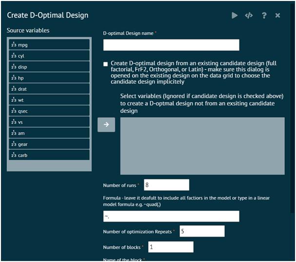
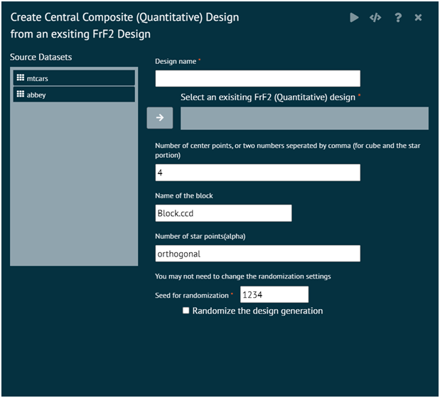
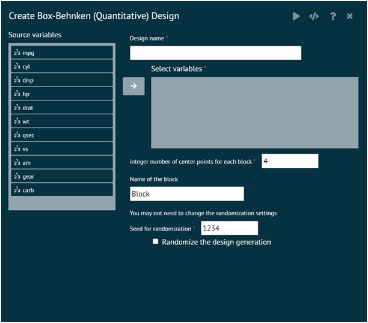
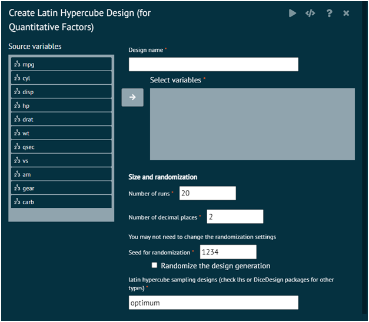
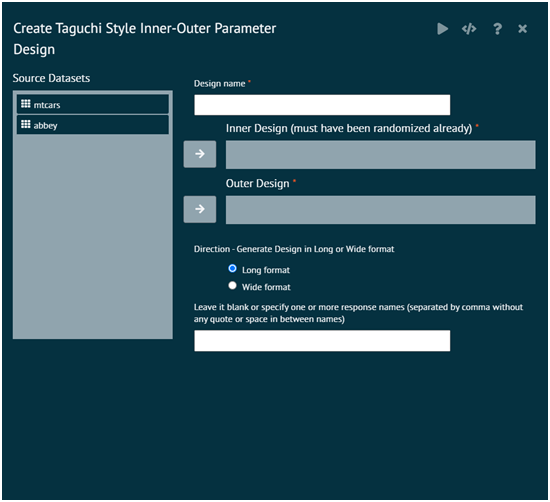

# Create Design

### Create 2-level Screening Design

{ width="700" }{ border-effect="rounded" }

### Create Regular (Fractional) Factorial 2-Level Design

{ width="700" }{ border-effect="rounded" }

### Create Full Factorial Design

{ width="700" }{ border-effect="rounded" }

### Create Orthogonal Array Design

{ width="700" }{ border-effect="rounded" }

### Create D-Optional Design

{ width="700" }{ border-effect="rounded" }

### Create Central Composite (Quantitative) Design

{ width="700" }{ border-effect="rounded" }

### Create Box-Behnken (Quantitative) Design

{ width="700" }{ border-effect="rounded" }

### Create Latin Hypercube(Quantitative) Design

{ width="700" }{ border-effect="rounded" }

### Create Taguchi Parameter Design

{ width="700" }{ border-effect="rounded" }
