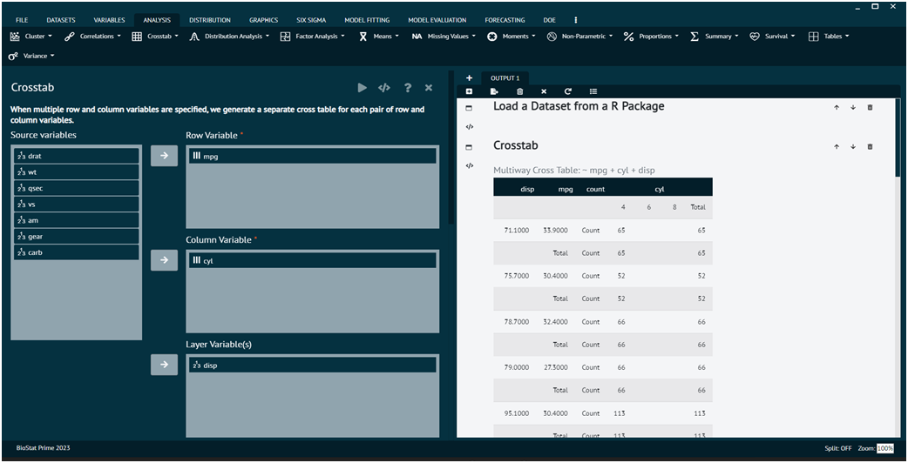
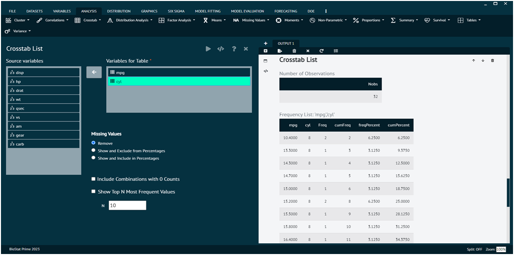
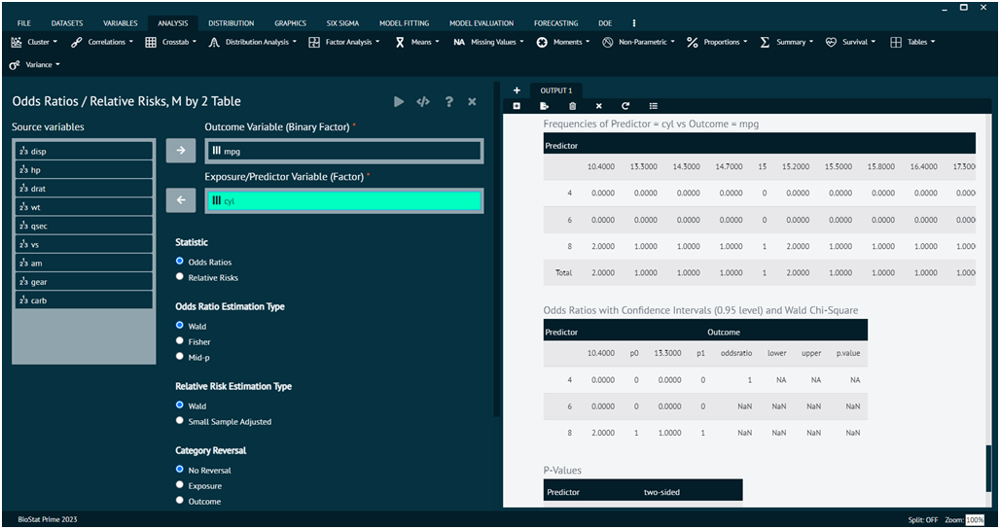

# Crosstab

In statistics, a crosstab, short for __"cross-tabulation"__ is a table that displays the relationships between two or more categorical variables. It provides a summary of the distribution of one variable in relation to another. 

Crosstabs are particularly useful for analyzing and visualizing the association or dependency between categorical variables. Crosstabs are used when both variables under consideration are categorical. Categorical variables have distinct categories or groups with no inherent order. 

The __chi-square test__ of independence is often used in conjunction with crosstabs to determine whether there is a statistically significant association between the variables. This test assesses whether the observed frequencies in the cells are significantly different from what would be expected if the variables were independent. 

BioStat Prime lays out 3 options in its Crosstab tab, i.e.

### Crosstab

The main purpose of a crosstab is to show the frequency distribution of one variable across the levels of another variable.

This sub menu creates crosstab with row, column and layer variables. When multiple row and column variables are specified, BioStat Prime generates a separate cross table for each pair of row and column variables. 

>Additionally, the following are displayed
>1. Expected counts
>2. Row and column percentages
>3. Unstandardized, standardized and adjusted residuals
>4. Chisq with odds ratio, McNemar and Fisher statistics

>NOTE: BioStat Prime automatically remove all rows where every
>
{Style="note"}

To analyse it in BioStat Prime user must follow the steps as given.

Steps
: __Load the dataset -> Click on the analysis tab in main menu -> Select Crosstab -> TheCrosstab contains 3 options, select the first one namely crosstab -> This leads to the crosstab analysis technique in the dialog -> Select the row and column variables -> Execute the dialog.__

{ width="700" }{ border-effect="rounded" }

The result of the analysis will be visible in the output. 

>When multiple row and column variables are specified, a separate cross table for each pair of row and column variables is generated.
>
{style="note"}

### Crosstab List

This sub menu creates frequency tables in a list format for combinations of one or more variables. Every combination of values across all specified variables will be tabled, with their observed frequencies. The specified variables can be any class, including `numeric`, `continuous` variables. 

While this can be used for summary frequencies and percentages, a major use is checking data for inconsistencies. 

>Care should be taken about how many variables to cross-classify and how many possibilities can result, as some tables may take longer to produce.
>
{style="note"}

In addition to raw counts, crosstabs often include percentages. These can be row percentages (percentage within each row) or column percentages (percentage within each column).

To analyse it in BioStat Prime user must follow the steps as given.

Steps
: __Load the dataset -> click on the analysis tab in main menu -> Select Crosstab -> The Crosstab contains 3 options, select the second one namely crosstab list -> This leads to the crosstablist analysis technique in the dialog -> Select variables for the table -> Execute the dialog.__

{ width="700" }{ border-effect="rounded" }

User can also opt for other options at the bottom related to __frequencies__, __include combinations with 0 counts__, __show top N most frequent values__.

The arguments used is executing the dialog are given as follows.

Variables for Table
: Variables to be included in the table, which can be any class. The table will be sorted according to the order of variables in this list. This means if variables A and B are the specified order, then the table will be sorted by levels of A, then levels of B within A.

Missing Values
:
__Remove__: Variable value combinations that have NA's will be excluded from the table.                                                                                                                                                                                                
__Show and Exclude from Percentages__: Variable value combinations that have NA's will be included in the table, but will not be included in percentage computations.                                                                                                                   
__Show and Include in Percentages__: Variable value combinations that have NA's will be included in the table and be included in percentage computations.    

Include Combinations with 0 Counts
: Whether to include variable value combinations that don't exist in the dataset. For example, if variables A and B both have observed values of 1, 2, and 3, but (A, B) combination (1, 3) isn't observed in the data, this option would include a row for the (1, 3) combination with a frequency of 0.

Show Top N Most Frequent Values
: If checked, this would create a separate table with the top N most frequent variable combinations.     
__N__: How many variable combinations to show for the top N table.

>R Packages Required: arsenal
>
{style="note"}

### Odds Ratio/ Relative Risks, M by 2 Table

When working with a crosstab (contingency table) that involves categorical variables, measures such as odds ratios, relative risks, and the chi-square test (often referred to as the "chi-square test of independence") are commonly used to assess associations between variables.

>The odds ratio is a measure of association between two binary variables. It is commonly used in case-control studies or situations where the outcome is dichotomous.       
The odds ratio indicates the odds of an event occurring in one group relative to the odds in another group.

>The relative risk (RR) is another measure of association, commonly used in cohort studies or situations where the outcome is binary.       
The relative risk indicates the risk of an event occurring in one group relative to the risk in another group.

>The chi-square test is used to assess whether there is a statistically significant association between two categorical variables.       
The test involves comparing the observed frequencies in a contingency table with the frequencies that would be expected under the assumption that the variables are independent .      
__A significant chi-square test suggests that the variables are associated.__

>The choice between odds ratio and relative risk depends on the study design and the nature of the data. Chi-square test is used to determine whether observed associations are statistically significant.
>
{style="note"}

{ width="700" }{ border-effect="rounded" }

To analyze all three of them in BioStat Prime user must follow the steps as given.

Steps
: __Load the dataset -> Click on the analysis tab in main menu -> Select Crosstab -> TheCrosstab contains 3 options, select the third one namely Odds Ratio/ Relative Risks, M by 2 Table -> This leads to the crosstablist analysis technique in the dialog -> Select variables for the table -> Execute the dialog.__

This Sub menu is used to compare probabilities of having a "disease" for one group relative to another, in a ratio of odds (odds ratio) form or probability ratio (relative risk) form. 

>The odds of "disease" is defined as the probability of "disease" divided by the probability of "no disease". 
>
{style="note"}

>A contingency table of outcome frequencies in each group is provided. 

>In addition, a table of odds ratios or relative risks for each group relative to the reference group with confidence intervals and a Wald Chi-Square p-value is included. 

>Lastly, a table of p-values is shown with mid-p exact, Fisher's exact, and Wald Chi-Square versions, comparing each group to the reference group.

The arguments used is executing the dialog are given as follows.

Outcome Variable
: Binary "disease" (yes/no) variable of interest. By default, the highest category in the sort order is defined as "disease yes".

Exposure/Predictor Variable
: Groups to compare. Can have more than 2 groups.

Statistic
: Which statistic to compute

Odds Ratio / Relative Risk Estimation Type
: Wald (unconditional maximum likelihood), Fisher (conditional maximum likelihood), Mid-p (median unbiased method), or Small Sample Adjusted