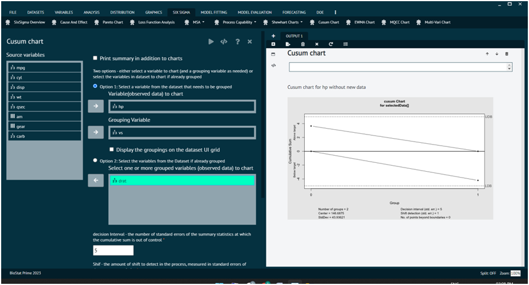

# Cusum Chart

A Cumulative Sum (CUSUM) chart is a statistical control chart that is used in Six Sigma and other quality management methodologies to monitor the stability of a process over time. The CUSUM chart is particularly useful for detecting small, persistent shifts in the process mean.

To analyse Cumulative Sum (CUSUM) chart in BioStat user must follow the steps given below.

Steps
: __Load the dataset -> Click on the Six Sigma tab in main menu -> Select Cumulative Sum (CUSUM) chart -> This leads to analysis techniques in the dialog -> Selected the various options in the dialog according to the requirement ->Execute and visualise the output in output window.__

{ width="700" }{ border-effect="rounded" }
