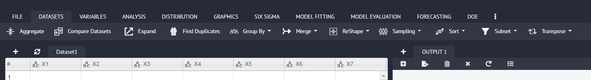

# Dataset

This section of the main menu gives access to the data manipulation commands for the sake of proper and customised analysis of the given dataset. It leads the user to sub functions like; 

[`Aggregate`](Aggregate.md), [`Compare Dataset`](Compare-Dataset.md), [`Expand`](Expand.md), [`Find Duplicates`](Find-Duplicates.md), [`Group By`](Group-By.md), [`Merge`](Merge.md), [`ReShape`](ReShape.md), [`Sampling`](Sampling.md), [`Sort`](Sort.md), [`Subset`](Sampling.md), [`Transpose`](Transpose.md).

{ width="700" }{ border-effect="rounded" }

The above-mentioned functions are discussed in detail in the up-coming section.
