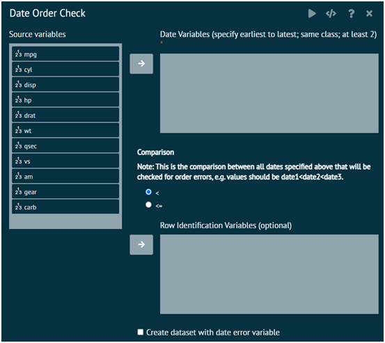

# Date order check
This creates a list of rows in the active dataset where date variable values are not in a specified order. This helps identify potential date variable errors when dates or times are needed for an analysis. 

For example, if three date columns are supposed to be in the order of date1 < date2 < date3, this dialog will print all observations where the values of those variables do not follow that order. 

>Missing date values are allowed in the specified variables and will not be used for any comparisons.
>
{style="note"}

{ width="700" }{ border-effect="rounded" }

The arguments used is executing the dialog are given as follows.

__Date Variables__ (specify earliest to latest; same class; at least 2)
: Specify at least 2 date variables in the order of earliest to latest. These can be any date class (POSIXct, Date), but all variables specified must be the same date class. If not, an error will result.

__Comparison__
: Specify the comparison operator used to compare the date values. "<" means less than and "<=" means less than or equal to. If "<" is chosen, then dates that are equal will be flagged as errors. If "<=" is chosen, then dates that are equal will not be flagged as errors.

__Row Identification Variables__ (optional)
: Specify one or more variables that may be useful to identify the rows. For example, subject identification number. These will be included in the list of errors. If no variables are specified, the row number of the dataset will be the only identifier.

__Create dataset with date error variable__
: This will create a separate data set with the original data and a variable indicating whether each observation has a date order error (coded as 1=date order error and 0=no date order error). The Dataset name is the desired name of this data set and Date error variable name is the desired name of the date order error variable in this data set.
