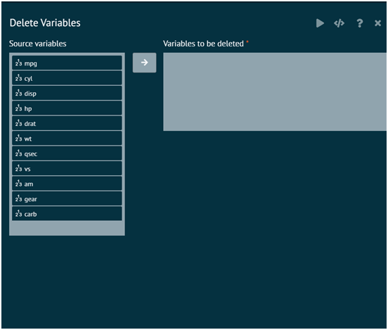

# Delete Variable
Removes missing values/NA from dataset/dataframe. Creates new/Overwrites existing dataset by removing rows with one or more missing values for the columns/variable names selected

{ width="700" }{ border-effect="rounded" }