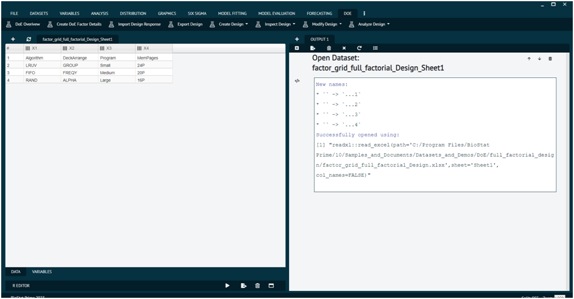

# Design of Experiment-Quality Control

Using __Design of Experiments (DOE)__ techniques, user can determine the individual and interactive effects of various factors that can influence the output results of your measurements.

>The primary goal of DOE is to optimize processes, improve product or system performance, and understand the relationship between input variables and the output response.  

>User can also use DOE to gain knowledge and estimate the best operating conditions of a system, process or product.

To analyse it in BioStat user must follow the steps as given.

1. To create any Design under __DOE -> create design__ menu, first user needs a dataset with factor details to create the design from.
2. To get started, choose one of the sample datasets (Excel file) provided in the sample dataset directory in your BioStat Prime install directory or user can create a factor detail table/dataset on the fly with __DOE -> Create DoE Factor Details__ menu.

{ width="700" }{ border-effect="rounded" }

3. Once a dataset is opened with file open menu or created on the fly in step two above, go under __DOE -> create design menu to create an appropriate design__.

{ width="700" }{ border-effect="rounded" }

4. After a design is successfully created, it will show up on the dataset UI grid. Users can use __DOE -> Inspect Design menu to inspect the design just created.__

{ width="700" }{ border-effect="rounded" }

5. Export the design to a file system directory with __DOE -> Export Design__ menu. It will automatically create three files (.csv, rda, .html) with the same names as the design dataset on the UI grid in the file directory path specified.
6. The csv file exported out in step 5 is meant to be used to set up the experiments in the real world as specified in the design to collect/record results for later analysis.
7. The results are recorded and added as separate column(s) called responses in the DoE vocabulary into the csv file. Do not change the csv file extension to any other file format. See the sample dataset directory for DoE, examples of csv files tagged as with respect to get the values for the result/response columns to copy from to create response columns in your own csv file that was exported as part of design export in step 5 above.
8. Import the csv design file with response column(s) added back to BioStat Prime app with __DOE -> Import Design Response__ menu.

{ width="700" }{ border-effect="rounded" }

9. To import the design csv file in step 8, the original design (that was exported) needs to be available in the dataset UI grid. If it is not available, use the file open menu to load the design .rda file that was created as part of the design export in step 5.
10. After the csv file is successfully imported against the right/active design dataset and created a new design with the response column(s), user can use __DOE -> Inspect Design__ menu to inspect the design with response column(s).
11. Now the design with response column(s) is ready for analysis with __DOE -> Analyze Design__ menu with various analysis methods e.g. Linear model, Response Surface model, etc.
12. The datasets to use to test the DoE dialog will be indicated in BioStat Prime DoE dialog __help (?)__. 

>User may find all sample DoE datasets in the installation directory of BioStat Prime.
>
{style="note"}

The various sub menus available in DoE menu are explained in up-coming section.

