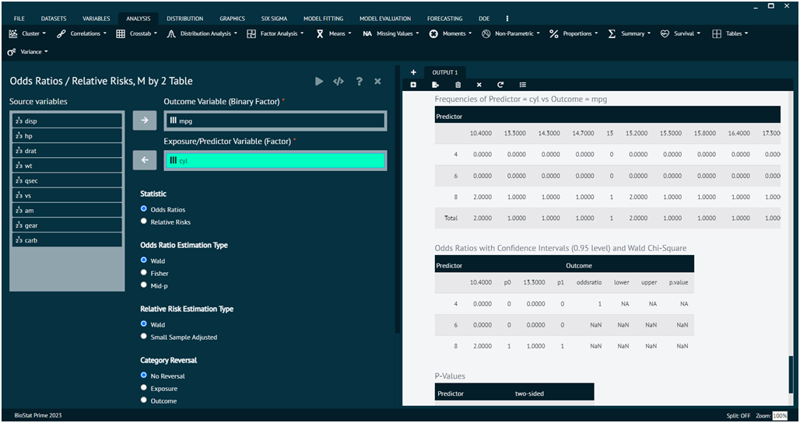
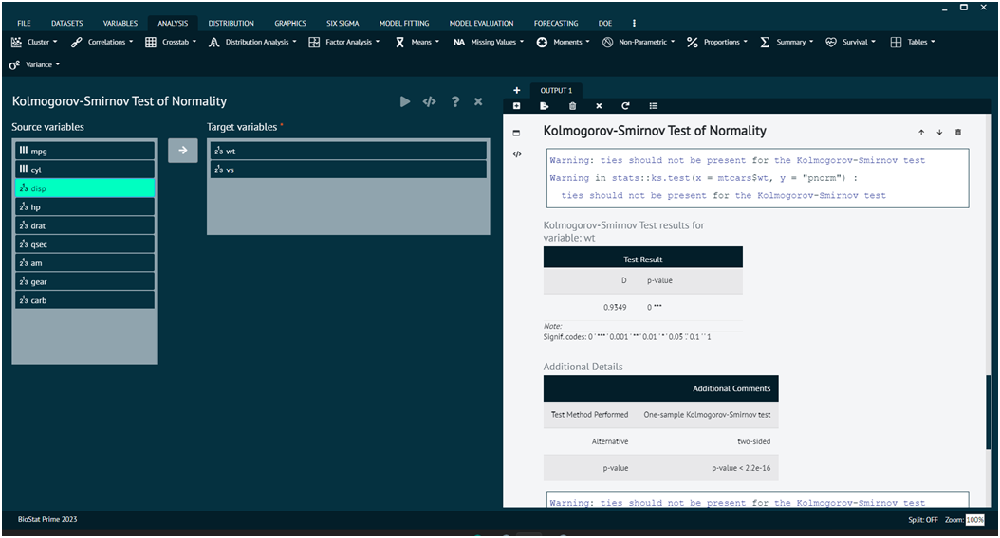
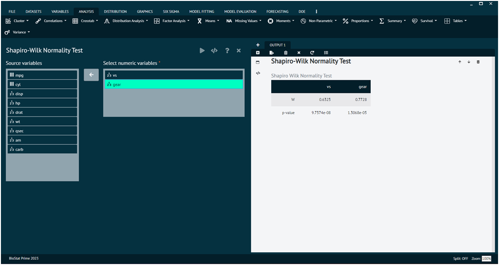
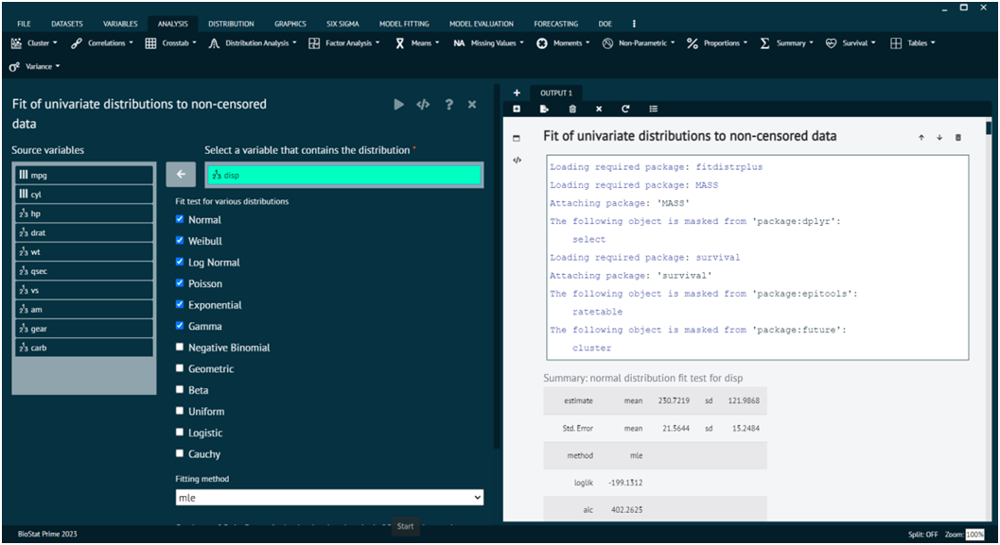
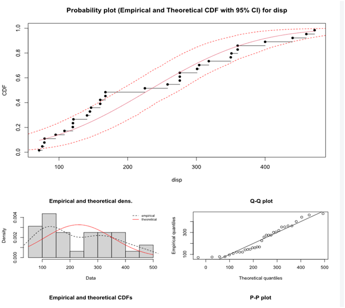
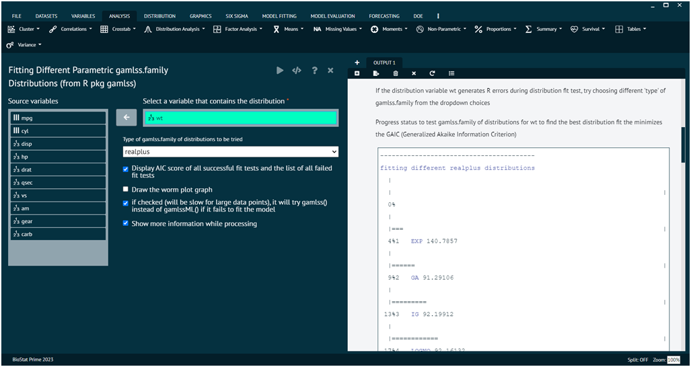
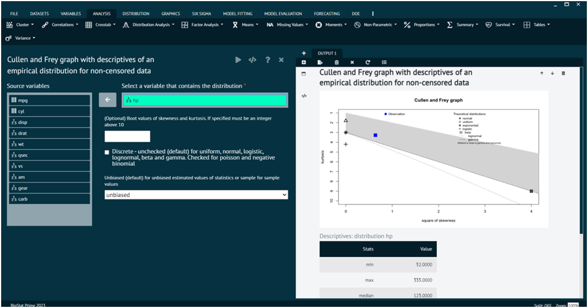

# Distribution Analysis

In statistics, a distribution refers to the set of all possible values and their corresponding probabilities or frequencies for a given variable. Understanding the distribution of data is fundamental in statistical analysis. Different statistical tests can be employed to assess whether a given dataset follows a specific distribution, such as the normal distribution. 

BioStat Prime brings forth some normality distribution tests under the distribution sub menu in analysis tab of main menu. The distribution tab comprises 7 normality test that are discussed below in detail. 

>Users must keep in mind that normality tests are sensitive to sample size, and with large sample sizes, even small departures from normality may lead to rejecting the null hypothesis. 
> 
{style="note"}

>It's essential to consider the context of your data and the specific requirements of user’s analysis when interpreting the results of normality tests.

### Anderson-Darling Normality Test

The Anderson-Darling test is one such test, and it is specifically used for testing the goodness of fit of a sample to a specified distribution, often the normal distribution. 

>The Anderson-Darling test is more sensitive to deviations in the tails of the distribution compared to other normality tests like the Shapiro-Wilk test.
>
{style="note"}

To analyse it in BioStat Prime user must follow the steps as given.

Style
: __Load the dataset -> Click on the analysis tab in main menu -> Select Distribution tab -> The Distribution tab contains 7 options, select the first one namely Anderson-Darling Normality test -> This leads to analysis technique in the dialog -> Select variables to target -> Execute the dialog.__

{ width="700" }{ border-effect="rounded" }

### Kolmogorov-Smirnov Normality Test

The Kolmogorov-Smirnov (K-S) test for normality is a non-parametric test used to determine whether a sample comes from a normal distribution. It is based on the __cumulative distribution function (CDF)__ of the normal distribution and involves comparing the observed cumulative distribution of the data with the expected cumulative distribution of a normal distribution. 

>The Kolmogorov-Smirnov test is sensitive to departures from normality in both the center and the tails of the distribution. 
>
{style="note"}

>When the sample size is small, the test may have limited power to detect deviations from normality.
>
{style="note"}

To analyse it in BioStat Prime user must follow the steps as given.

Steps
: __Load the dataset -> Click on the analysis tab in main menu select Distribution tab -> The Distribution tab contains 7 options, select the second one namely Kolmogorov-Smirnov Normality test -> This leads to analysis technique in the dialog -> Select variables to target -> Execute the dialog.__

{ width="700" }{ border-effect="rounded" }

### Shapiro-Wilk Normality Test

The Shapiro-Wilk test is a statistical test used to assess whether a sample comes from a normally distributed population. It is commonly used for __testing the assumption of normality__ in statistical analyses. 

>The test is particularly useful when dealing with smaller sample sizes.
> 
{style="note"}

>The Shapiro-Wilk test is sensitive to deviations from normality, especially in the tails of the distribution.

To analyse it in BioStat Prime user must follow the steps as given.

Steps
: __Load the dataset -> Click on the analysis tab in main menu -> Select Distribution tab -> The Distribution tab contains 7 options, select the third one namely Shapiro-Wilk Normality Test -> This leads to the analysis technique in the dialog -> Select variables to target -> Execute the dialog.__

{ width="700" }{ border-effect="rounded" }

### Distribution Fit

Distribution fitting is a statistical technique used to model and describe the distribution of a dataset by finding the probability distribution that best fits the observed data. 

>The goal is to identify __a parametric distribution (such as normal, exponential, gamma, etc.)__ that provides a good representation of the data.

To analyse it in BioStat Prime user must follow the steps as given.

Step
: __Load the dataset -> Click on the analysis tab in main menu -> Select Distribution tab -> The Distribution tab contains 7 options, select the fifth one namely Distribution Fit -> This leads to the analysis technique in the dialog -> Select variables to target -> Fit the test for various distributions -> Execute the dialog.__

{ width="700" }{ border-effect="rounded" }

The various distributions are visible in the output window.

The four possible fitting methods are described below:

mle
: When method="mle" (default) Maximum likelihood estimation consists in maximizing the log-likelihood. A numerical optimization is carried out in mledist via optim to find the best values (see mledist for details).

mme
: When method="mme" Moment matching estimation consists in equalizing theoretical and empirical moments. Estimated values of the distribution parameters are computed by a closed-form formula for the following distributions : "norm", "lnorm", "pois", "exp", "gamma", "nbinom", "geom", "beta", "unif" and "logis". Otherwise the theoretical and the empirical moments are matched numerically, by minimization of the sum of squared differences between observed and theoretical moments. In this last case, further arguments are needed in the call to fitdist: order and memp (see mmedist for details).

qme
: When method = "qme" Quantile matching estimation consists in equalizing theoretical and empirical quantile. A numerical optimization is carried out in qmedist via optim to minimize of the sum of squared differences between observed and theoretical quantiles. The use of this method requires an additional argument probs, defined as the numeric vector of the probabilities for which the quantile(s) is(are) to be matched (see qmedist for details).

mge
: When method = "mge" Maximum goodness-of-fit estimation consists in maximizing a goodness-of-fit statistics. A numerical optimization is carried out in mgedist via optim to minimize the goodness-of-fit distance. The use of this method requires an additional argument gof coding for the goodness-of-fit distance chosen. One can use the classical Cramer-von Mises distance ("CvM"), the classical Kolmogorov-Smirnov distance ("KS"), the classical Anderson-Darling distance ("AD") which gives more weight to the tails of the distribution, or one of the variants of this last distance proposed by Luceno (2006) (see mgedist for more details). This method is not suitable for discrete distributions.

mse
: When method = "mse" Maximum goodness-of-fit estimation consists in maximizing the average log spacing. A numerical optimization is carried out in msedist via optim.

>convergence is an integer code for the convergence of optim/constrOptim defined as below or defined by the user in the user-supplied optimization function. 0 indicates successful convergence. 1 indicates that the iteration limit of optim has been reached. 10 indicates degeneracy of the Nealder-Mead simplex. 100 indicates that optim encountered an internal error.

>Goodness-of-fit statistics are computed by gofstat(). The Chi-squared statistic is computed using cells defined by the argument chisqbreaks or cells automatically defined from data, in order to reach roughly the same number of observations per cell, roughly equal to the argument meancount, or sligthly more if there are some ties.

>For continuous distributions, Kolmogorov-Smirnov, Cramer-von Mises and Anderson-Darling and statistics are also computed, as defined by Stephens (1986).

Statistics of importance are Cramer-von Mises, Anderson-Darling and Kolmogorov statistics for continuous distributions and Chi-squared statistics for discrete ones ( "binom", "nbinom", "geom", "hyper" and "pois" )

{ width="700" }{ border-effect="rounded" }

### Distribution Fit with Gamlss

The Gamlss package in R is used for __fitting Generalized Additive Models for Location, Scale, and Shape (GAMLSS)__. 

GAMLSS is a flexible framework for modeling distributions and is capable of handling a wide range of distributional shapes. 

BioStat Prime utilizes this package of R to aids user to fit different parametric gamlss.family distributions from R pkg gamlss.

To analyse it in BioStat Prime user must follow the steps as given.

Steps
: __Load the dataset -> Click on the analysis tab in main menu -> Select Distribution tab -> The Distribution tab contains 7 options, select the sixth one namely Distribution Fit with Gamlss -> This leads to the analysis technique in the dialog -> Select variables that contains distribution -> Check the options at the bottom as per the preference -> Execute the dialog.__

{ width="700" }{ border-effect="rounded" }

The function fitDist() is using the function gamlssML() to fit all relevant parametric gamlss.family distributions, specified by the argument type, to a single data vector (with no explanatory variables). The final marginal distribution is the one selected by the generalised Akaike information criterion with penalty k. The default is k=2 i.e AIC which means that the "best" distribution is selected according to the classic AIC. k can be set to anything, such as log(n) for the BIC (not provided on the dialog at this time)

__The following are the different type argument:__

realAll
: All the gamlss.family (not provided on the dialog at this time) continuous distributions defined on the real line, i.e. realline and the real positive line i.e. realplus

realline
: The gamlss.family continuous distributions : "NO", "GU", "RG" ,"LO", "NET", "TF", "TF2", "PE","PE2", "SN1", "SN2", "exGAUS", "SHASH", "SHASHo","SHASHo2", "EGB2", "JSU", "JSUo", "SEP1", "SEP2", "SEP3", "SEP4", "ST1", "ST2", "ST3", "ST4", "ST5", "SST", "GT"

realplus
: The gamlss.family continuous distributions in the positive real line: "EXP", "GA","IG","LOGNO", "LOGNO2","WEI", "WEI2", "WEI3", "IGAMMA","PARETO2", "PARETO2o", "GP", "BCCG", "BCCGo", "exGAUS", "GG", "GIG", "LNO","BCTo", "BCT", "BCPEo", "BCPE", "GB2"

real0to1
: The gamlss.family continuous distributions from 0 to 1: "BE", "BEo", "BEINF0", "BEINF1", "BEOI", "BEZI", "BEINF", "GB1""

counts
: The gamlss.family distributions for counts: "PO", "GEOM", "GEOMo","LG", "YULE", "ZIPF", "WARING", "GPO", "DPO", "BNB", "NBF","NBI", "NBII", "PIG", "ZIP","ZIP2", "ZAP", "ZALG", "DEL", "ZAZIPF", "SI", "SICHEL","ZANBI", "ZAPIG", "ZINBI", "ZIPIG", "ZINBF", "ZABNB", "ZASICHEL", "ZINBF", "ZIBNB", "ZISICHEL"

binom
: The gamlss.family distributions for binomial type data :"BI", "BB", "DB", "ZIBI", "ZIBB", "ZABI", "ZABB"

### Distribution Analysis Cullen and Frey Graph

The Cullen and Frey graph, also known as the Cullen and Frey graph for skewness and kurtosis, is a graphical method for assessing the skewness and kurtosis of a dataset. It's a visual tool that helps you quickly inspect the departure from normality in terms of skewness and kurtosis.

BioStat Prime aids users to derive Cullen and frey graph with descriptive of an empirical distribution of a non-censored data.

To analyse it in BioStat Prime user must follow the steps as given.

Steps
: __Load the dataset -> Click on the analysis tab in main menu -> Select Distribution tab -> The Distribution tab contains 7 options, select the seventh one namely Distribution Analysis Cullen and Frey Graph -> This leads to the analysis technique in the dialog -> Select variables that contains distribution -> Check the options at the bottom as per the preference -> Execute the dialog.__

{ width="700" }{ border-effect="rounded" }
