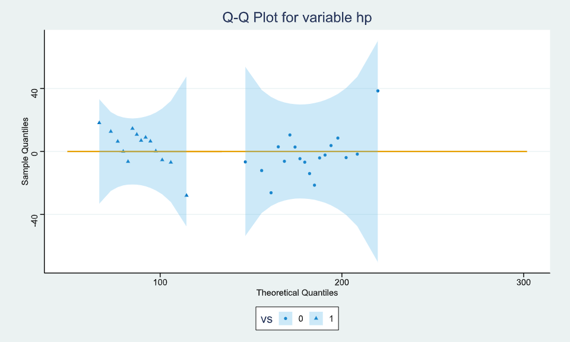

# Distribution Plot

The distribution tab of graphics menu contains 4 options of data visualization i.e., `Density`, `Histogram`, `P-P plot`, `Q-Q plot`.

{ width="700" }{ border-effect="rounded" }

The function of each option is discussed below.

### Density

For representing any dataset in terms of Density plot.

Steps
: __Load the dataset that needs to be visualized -> Go to Graphics -> Distribution -> Density -> Put in the values for variables -> Execute the dialog.__

The output of the Density Plot of a sample dataset can be seen in the picture below.

{ width="700" }{ border-effect="rounded" }

>The Options tab and Facets tab at the bottom can be utilized to add more features to the output. 
>
{style="note"}

>User can also select the position to control overlapping, flip axes and opacity of the output.
>
{style="note"}

### Histogram

For representing any dataset in terms of Histogram.

Steps
: __Load the dataset that needs to be visualized -> Go to Graphics -> Distribution -> Histogram -> Put in the values for variables -> Execute the dialog.__

The output of the Histogram of a sample dataset can be seen in the picture below.

{ width="700" }{ border-effect="rounded" }

>The Options tab and Facets tab at the bottom can be utilized to add more features to the output. 
>
{style="note"}

>User can also control opacity, flip axes and display normal curve of the output.
>
{style="note"}

### PP Plot

For representing any dataset in terms of PP Plot.

Steps
: __Load the dataset that needs to be visualized -> Go to Graphics -> Distribution -> PP -> Put in the values for variables -> Execute the dialog.__

The output of the PP Plots of a sample dataset can be seen in the picture below. 

{ width="700" }{ border-effect="rounded" }

>The Options tab and Facets tab at the bottom can be utilized to add more features to the output. 
>
{style="note"}

>User can also control opacity, flip axes and display reference line or bands or detrend in the output.
>
{style="note"}

### QQ Plot

For representing any dataset in terms of QQPlot.

Steps
: __Load the dataset that needs to be visualized -> Go to Graphics -> Distribution -> PP -> Put in the values for variables -> Execute the dialog.__

The output of the QQ Plots of a sample dataset can be seen in the picture below.

{ width="700" }{ border-effect="rounded" }

>The Options tab and Facets tab at the bottom can be utilized to add more features to the output. 
>
{style="note"}

>User can also control opacity, flip axes and display reference line or bands or detrend in the output.
>
{style="note"}