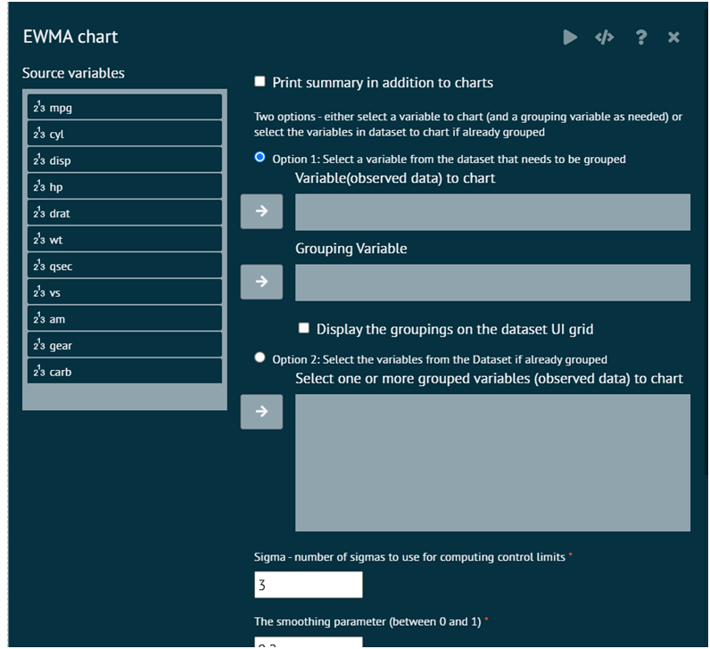

# EWMA Chart

An Exponentially Weighted Moving Average (EWMA) chart is a type of statistical control chart that is used to monitor the stability of a process over time. It is particularly useful when there is a need to give more weight to recent data points, making it sensitive to changes in the process mean.

To analyse EWMA chart in BioStat user must follow the steps given below.

Steps
: __Load the dataset -> Click on the Six Sigma tab in main menu -> Select EWMA chart -> This leads to analysis techniques in the dialog -> Selected the various options in the dialog according to the requirement -> Execute and visualise the output in output window.__

{ width="700" }{ border-effect="rounded" }
