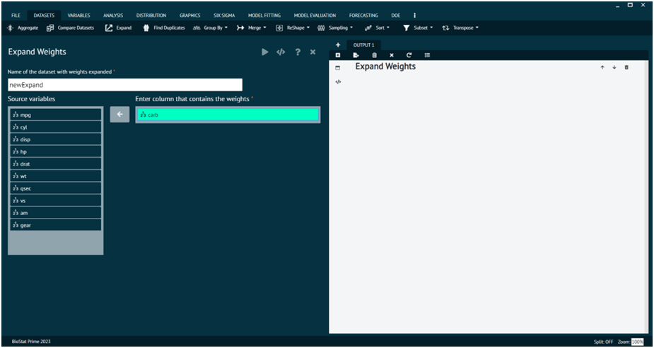
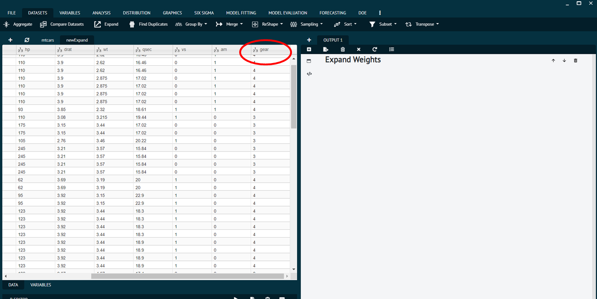
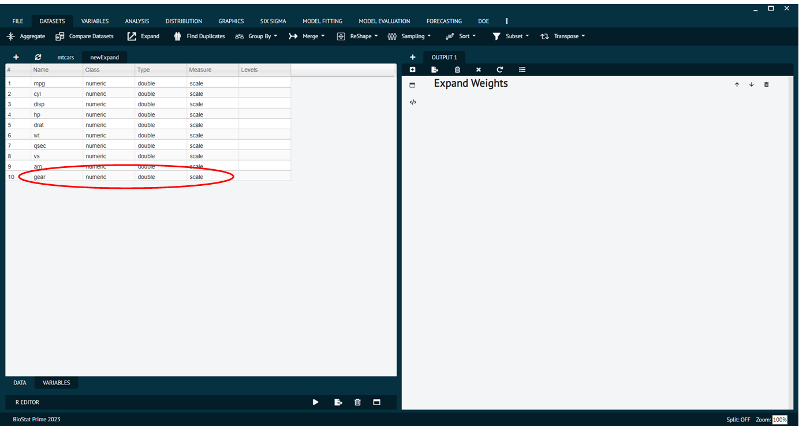
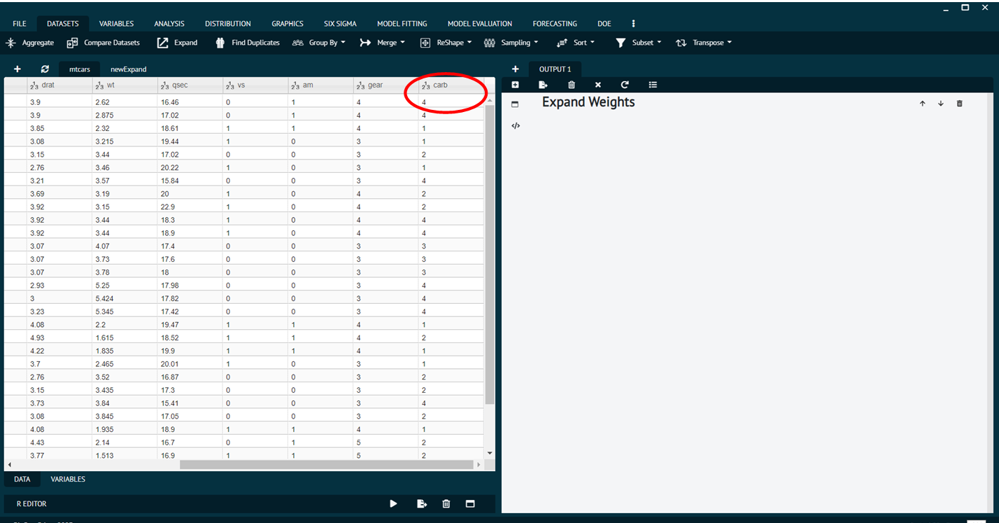
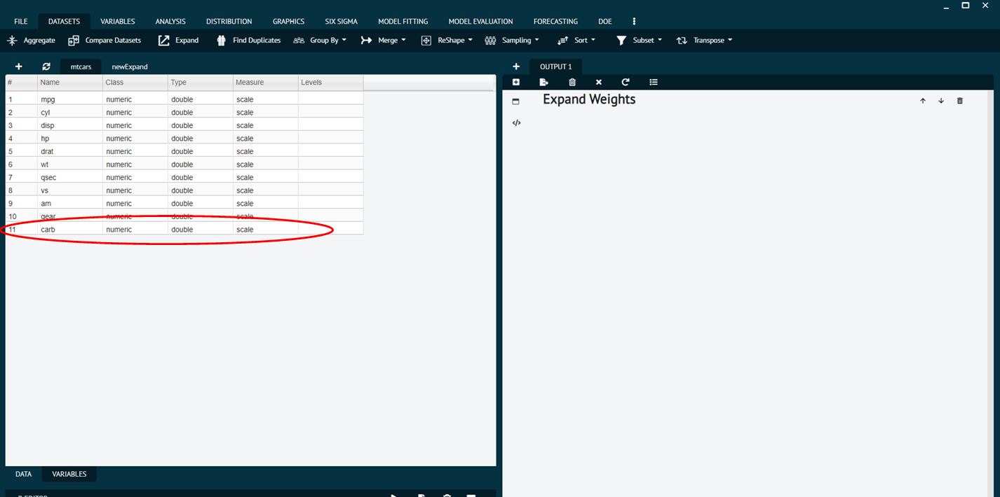

# Expand

Creates a new dataset with rows expanded as per weights. In this dialog the weights refer to the dataset variable that contains the weights.

To expand weights user needs to follow the steps given bellow.

Steps
:
__Load the dataset -> Click on the DATASET tab in main menu -> select EXPAND -> Once the dialog appears choose the Variable to be expanded -> Execute the dialog.__

{ width="700" }{ border-effect="rounded" }

Before expanding weights.

{ width="700" }{ border-effect="rounded" }

{ width="700" }{ border-effect="rounded" }

After Expanding weights.

{ width="700" }{ border-effect="rounded" }

{ width="700" }{ border-effect="rounded" }

The arguments used is executing the dialog are given as follows.

>Arguments
> 1. Weights: The dataset variable that contains the weights.
> 2. data: The input data.frame or data.table.
> 3. newdata: The new dataset where the rows are replicated for the weights specified.