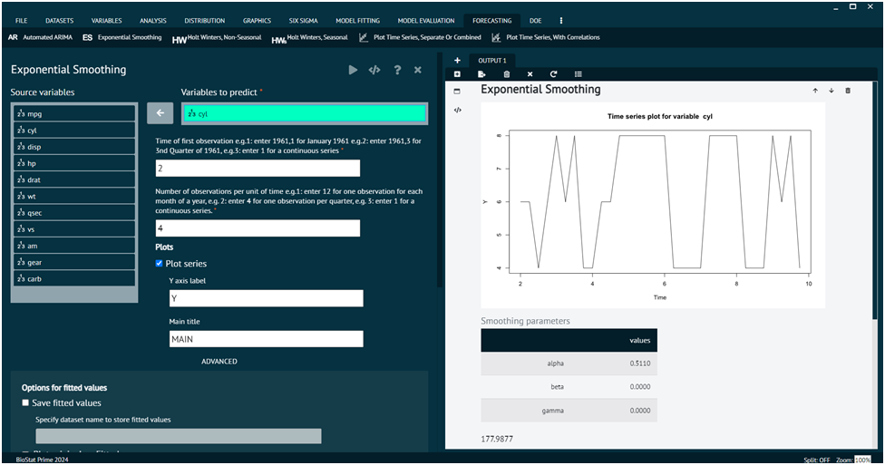

# Exponential Smoothing (ES)

Exponential smoothing is a time series forecasting method used in statistics. It is particularly useful for forecasting data points that exhibit a consistent pattern or trend over time. Exponential smoothing assigns exponentially decreasing weights to older observations in a time series, with more recent observations receiving higher weights. This approach is effective in capturing short-term fluctuations and trends in the data. The basic idea behind exponential smoothing is to assign weights to past observations, with the weights decreasing exponentially as the observations get older. The most commonly used exponential smoothing method is called Simple Exponential Smoothing (SES).

To analyse it in BioStat Prime user must follow the steps as given.

Steps
: __Load the dataset -> Click on the Forecasting tab in main menu -> Select Exponential Smoothing (ES) -> Choose variables to predict -> Write Time of first observation -> Write Number of observations per unit of time -> Execute.__

{ width="700" }{ border-effect="rounded" }

## Arguments

vars
: select a variable to build a model for

start
: Time of first observation should be entered in the format year,month or year,quarter e.g.( if your data is organized in months the 1992,1 for Jan 1992 or if your data is organized in quarters then 1992,1 refers to the first quarter of 1992.

frequency
: Number of observations in unit time. Example: for monthly there are 12 observation in a year. For quarterly there are 4 observation in a year.

exponential
: Determines whether exponential smoothing will be done, value set to TRUE

seasonal
: a character string "None" for exponential smoothing.

plotSeries
: if TRUE a time series plot will also be generated.

saveFitted
: if TRUE fit values are saved.

plotOriginalandForecast
: Plot original and forecasted series

predict
: if TRUE predicted values will also be generated.

savePredictedVals
: predicted values will be saved.

plotPredictedValues
: predicted values will also be plotted.

correlogram
: if TRUE a correlogram will be generated.

main
: main title of the plot

ylab
: title for the y axis

dataset
: the name of the dataset from which the variables have been selected

>The user can choose additional options like plot options.
